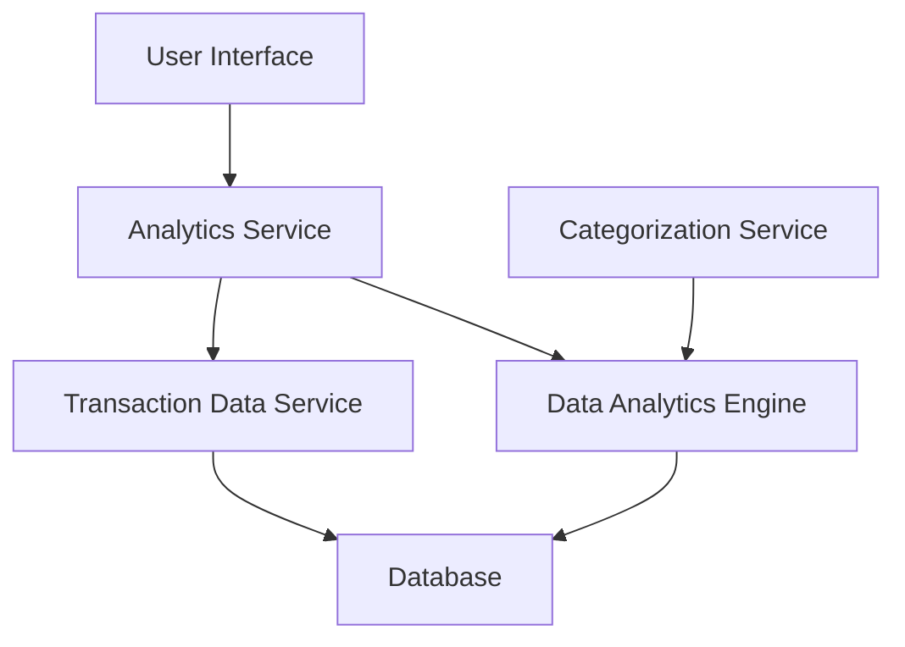

#### 1. High-Level Design

- **Summary**: This epic delivers interactive visualizations and analytics capabilities to help users understand their spending patterns across multiple categories. Users can view monthly spend trends over time and analyze spending by category (Food & Dining, Fuel, Shopping, Travel, Entertainment, Utilities, Healthcare, Education, and Miscellaneous). The solution enables data-driven decision-making for budget optimization and expense control.

- **Component Flow**:

- **Integration Points**: 
  - **Upstream**: Transaction Data Service (provides historical spending records for at least 12 months)
  - **Upstream**: Data Analytics Engine (performs trend calculation and pattern recognition)
  - **Upstream**: Categorization Service (provides automatic transaction classification into spending categories)

- **Key Assumptions**: 
  - Transaction data is pre-categorized or the categorization service provides real-time classification with sufficient accuracy
  - Historical data for 12 months is readily available in a queryable format from the transaction data service

- **NFR Highlights**: Analytics visualizations must render within 3 seconds; System must handle historical transaction data for at least 12 months; Charts must be interactive and responsive across all device types

#### 2. Validation Report

- **Requirements Coverage**: The design covers all stated requirements including monthly spend trends visualization, category-wise spending analysis (9 categories), interactive charts, and spending pattern identification. The architecture supports the NFR requirements for 3-second rendering, 12-month historical data handling, and responsive design across devices. Integration points with transaction data service, analytics engine, and categorization service are clearly identified and align with stated dependencies.