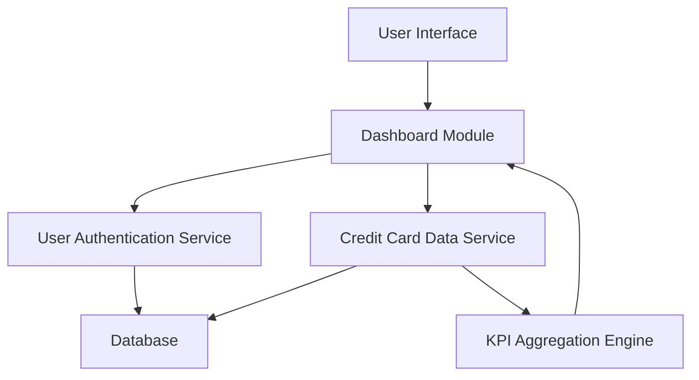

#### 1. High-Level Design

- **Summary**: This epic delivers a consolidated dashboard displaying key performance indicators (KPIs) across all user credit cards including monthly spend, total credit limit, available credit, and outstanding amounts. The dashboard provides real-time visibility with a responsive interface supporting desktop, tablet, and mobile devices for comprehensive credit portfolio management.

- **Component Flow**:

- **Integration Points**: 
  - **Upstream**: Credit Card Data Service (retrieves card details, balances, and limits), User Authentication Service (ensures secure access to user-specific card data)
  - **Downstream**: Responsive dashboard UI components rendering KPIs across multiple devices

- **Key Assumptions**: 
  - Credit card data is refreshed in near real-time or at frequent intervals (e.g., every 5-15 minutes) to maintain current KPI accuracy
  - Available credit is calculated as Total Credit Limit minus Outstanding Amount

- **NFR Highlights**: Dashboard must be responsive across desktop, tablet, and mobile devices; Real-time data refresh for KPIs; System must support concurrent viewing of multiple credit cards without performance degradation

#### 2. Validation Report

- **Requirements Coverage**: The design fully covers all scope requirements including dashboard KPIs display, monthly spend tracking, credit limit aggregation, available credit calculation, outstanding amount monitoring, multiple credit cards view, and responsive layout. The architecture integrates both specified dependencies (Credit Card Data Service and User Authentication Service) and addresses all stated NFRs for responsiveness, real-time refresh, and multi-card performance.