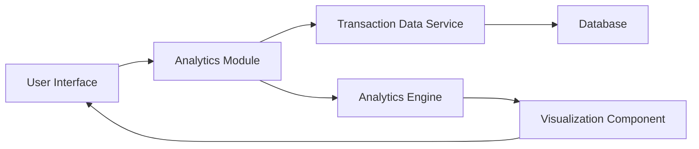

#### 1. High-Level Design

- **Summary**: This epic provides interactive spending analytics through visualizations including monthly spend trends, category-wise breakdowns across nine predefined categories (Food & Dining, Fuel, Shopping, Travel, Entertainment, Utilities, Healthcare, Education, Miscellaneous), and card-wise spend comparisons to enable data-driven budget optimization.

- **Component Flow**:

- **Integration Points**: 
  - **Upstream**: Transaction Data Service (retrieves transaction history), Analytics Engine (processes and aggregates spending data by category and time period)
  - **Downstream**: Interactive charts and graphs rendered in the user interface with responsive design

- **Key Assumptions**: 
  - Historical transaction data is pre-aggregated at daily or monthly intervals for efficient chart rendering
  - The nine spending categories are mutually exclusive and every transaction is assigned to exactly one category

- **NFR Highlights**: Interactive visualizations must load within 2 seconds; Charts must be responsive and support touch interactions on mobile devices; System must handle historical data aggregation efficiently

#### 2. Validation Report

- **Requirements Coverage**: The design addresses all scope elements including monthly spend trends, category-wise analysis across nine categories, card-wise spend analysis, and interactive visualizations. The architecture integrates both required dependencies (Transaction Data Service and Analytics Engine) and ensures efficient data aggregation for performance requirements.