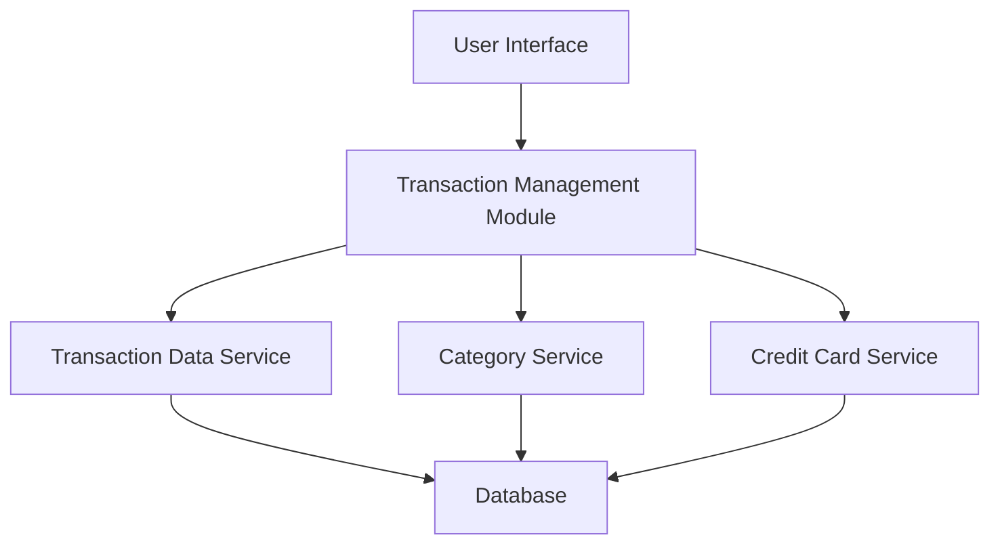

#### 1. High-Level Design

- **Summary**: This epic delivers comprehensive transaction viewing and management capabilities for credit card users. Users can access detailed transaction records, view history, categorize transactions, and use search/filter functionality to track spending across multiple credit cards with pagination support for large datasets.

- **Component Flow**:

- **Integration Points**: 
  - **Upstream**: Transaction Data Service (retrieves and stores transaction records), Category Service (provides transaction categorization), Credit Card Service (links transactions to specific cards)
  - **Downstream**: User Interface components for displaying transaction lists and details

- **Key Assumptions**: 
  - Transaction data is provided by backend services in a standardized JSON format with consistent field names
  - Pagination defaults to 20-50 transactions per page unless specified otherwise

- **NFR Highlights**: Transaction list must support pagination for large datasets; Search and filter operations must complete within 1 second; System must maintain transaction data integrity and accuracy

#### 2. Validation Report

- **Requirements Coverage**: The design covers all stated scope items including transaction listing, details view, categorization, multi-card support, and search/filter capabilities. The component flow integrates all three dependent services (Transaction Data Service, Category Service, Credit Card Service) as specified in the epic dependencies.