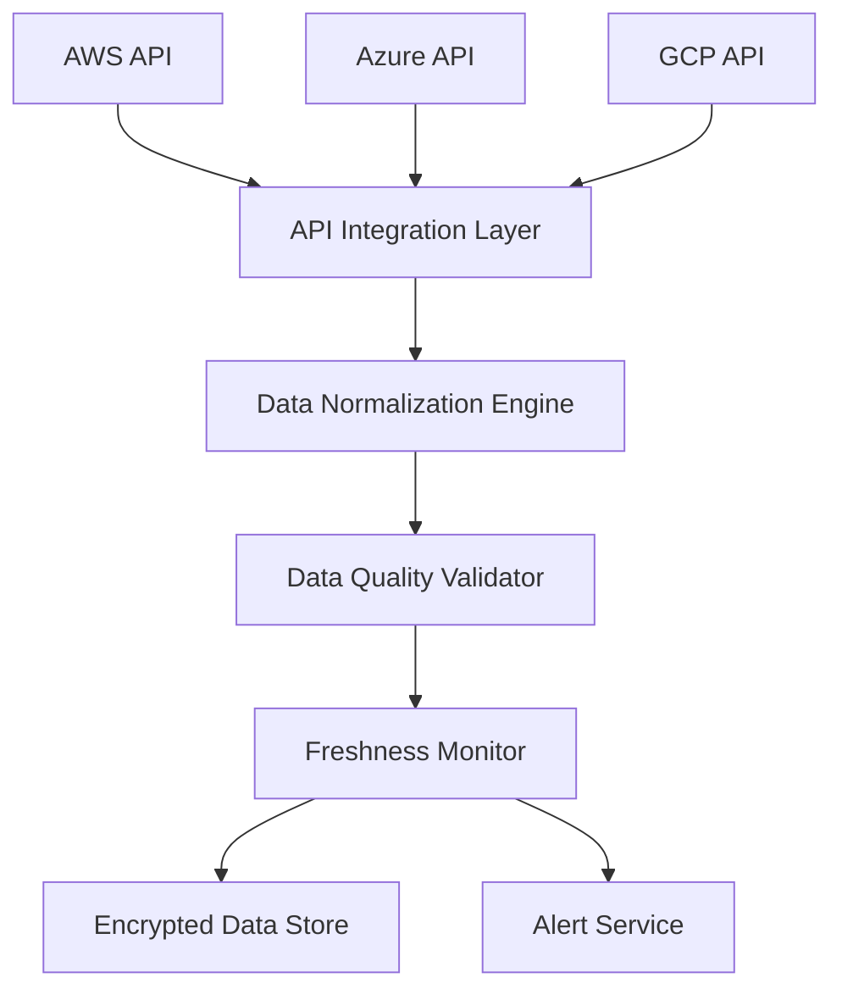

#### 1. High-Level Design

- **Summary**: This epic enables automated aggregation of AI usage and spend data from major cloud providers (AWS, Azure, GCP) through secure API integrations, providing real-time data collection, normalization, quality validation, and freshness monitoring with automated alerts to ensure data integrity across up to 50 portfolio companies.

- **Component Flow**:

- **Integration Points**: 
  - AWS AI services APIs for usage and spend data
  - Azure AI services APIs for usage and spend data
  - GCP AI services APIs for usage and spend data
  - Portfolio companies' cloud provider accounts (requires API access and permissions)

- **Key Assumptions**: 
  - Portfolio companies will grant necessary API permissions for read-only access to AI service usage and billing data
  - Cloud provider APIs will maintain backward compatibility and provide consistent data formats

- **NFR Highlights**: Supports up to 200 portfolio companies and 1,000 concurrent users; dashboard loads within 3 seconds for 95% of interactions; TLS 1.2+ and AES-256 encryption; 95% of data updated within 24 hours; 99.5% uptime with automated failover

#### 2. Validation Report

- **Requirements Coverage**: The design fully addresses all requirements including secure API integration with three major cloud providers, automated data ingestion and normalization, real-time synchronization, data freshness monitoring with alerts, and quality validation. The component flow demonstrates clear separation between API integration, data processing, validation, monitoring, and storage. All NFRs for scale (200 companies, 1,000 users), performance (3-second load time), security (encryption standards), data freshness (95% within 24 hours), and availability (99.5% uptime) are explicitly supported.