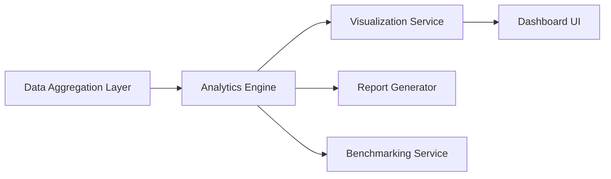

#### 1. High-Level Design

- **Summary**: This epic delivers a comprehensive dashboard interface that visualizes AI usage and spend data across the portfolio, providing customizable widgets, drill-down analytics, cross-company benchmarking, AI-driven cost optimization recommendations, and multi-format report exports to enable data-driven decision-making for both technical and non-technical stakeholders.

- **Component Flow**:

- **Integration Points**: 
  - Data aggregation layer from Epic QE-5557 (Data Integration and Aggregation)
  - Cloud provider data feeds for real-time metrics
  - Industry benchmarking data sources for cross-portfolio comparison

- **Key Assumptions**: 
  - Industry benchmarking data will be available through third-party APIs or data feeds
  - AI-driven cost optimization recommendations will use rule-based algorithms initially, with ML enhancement in future iterations

- **NFR Highlights**: Dashboard pages load within 3 seconds for 95% of interactions; supports up to 50 portfolio companies; WCAG 2.1 AA accessibility compliance including keyboard navigation and screen reader support

#### 2. Validation Report

- **Requirements Coverage**: The design covers all core requirements including consolidated views, customizable widgets, drill-down analytics, benchmarking, report generation, executive summaries, and AI-driven recommendations. The component flow shows clear data flow from aggregation through analytics to visualization and reporting. All NFRs for performance (3-second load time), scale (50 companies), and accessibility (WCAG 2.1 AA) are addressed.