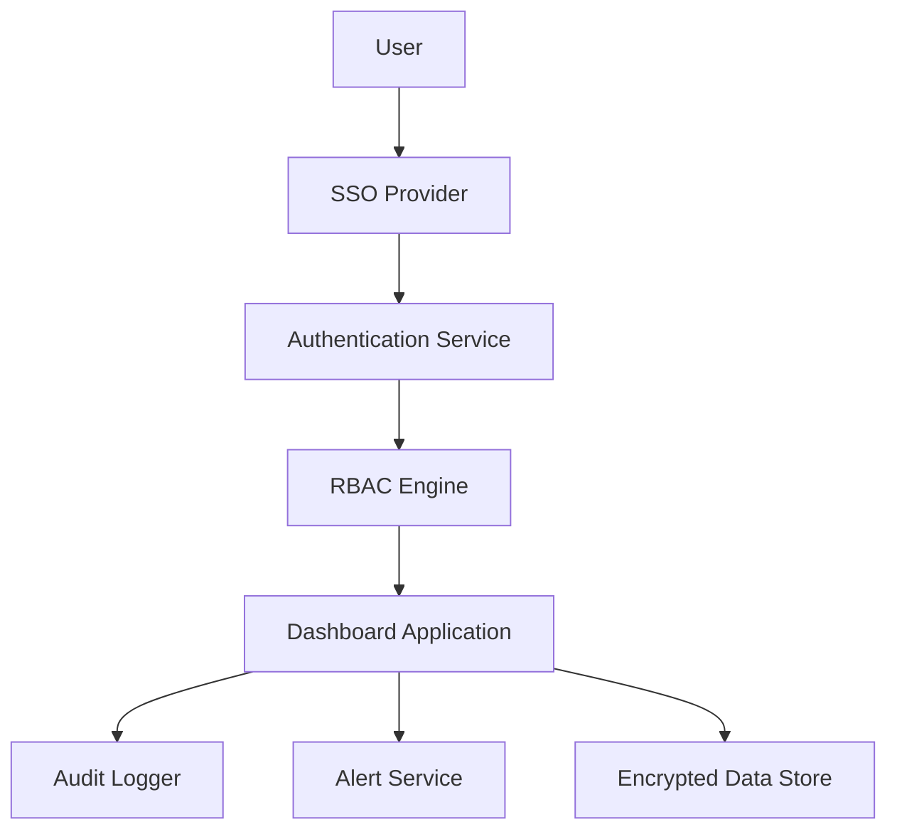

#### 1. High-Level Design

- **Summary**: This epic establishes a comprehensive security framework for the AI Portfolio Management Dashboard, implementing role-based access control (RBAC), SSO authentication, audit logging, automated alerting for budget thresholds, and data encryption to protect sensitive portfolio data while ensuring regulatory compliance and appropriate access for different stakeholder roles.

- **Component Flow**:

- **Integration Points**: 
  - Existing SSO provider for user authentication
  - Cloud provider security APIs for encryption and access control
  - Email notification service for budget alerts and user lockout recovery

- **Key Assumptions**: 
  - SSO provider supports standard protocols (SAML 2.0 or OAuth 2.0)
  - Portfolio companies will provide necessary permissions for data access control configuration

- **NFR Highlights**: All data encrypted using TLS 1.2+ in transit and AES-256 at rest; supports 1,000 concurrent users; 99.5% uptime; budget alerts within 5 minutes; lockout recovery emails within 2 minutes

#### 2. Validation Report

- **Requirements Coverage**: The design addresses all stated requirements including RBAC configuration, SSO integration, audit logging, automated alerting, user lockout recovery, and encryption. The component flow demonstrates clear separation of concerns between authentication, authorization, application logic, logging, and alerting. All NFRs regarding encryption standards, user capacity, uptime, and alert timing are explicitly supported.