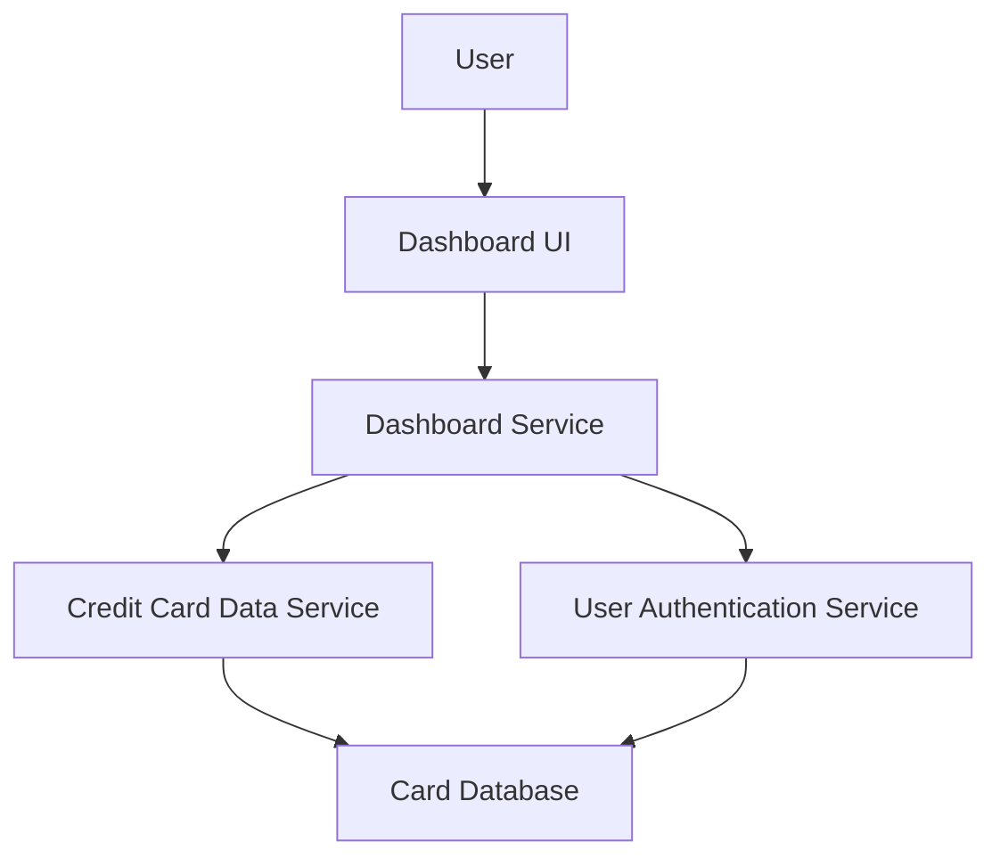

#### 1. High-Level Design

- **Summary**: This epic delivers a unified dashboard that consolidates key performance indicators (KPIs) for the user's credit card portfolio, including monthly spend, total credit limit, available credit, and outstanding amount. The dashboard provides multi-card overview capabilities in a responsive layout, enabling users to monitor their complete credit card financial health from a single interface.

- **Component Flow**:

- **Integration Points**: 
  - **Upstream**: Credit card data source/service (retrieves card details and balances), User authentication service (secures access)
  - **Downstream**: Responsive dashboard UI for desktop and mobile devices

- **Key Assumptions**: 
  - Credit card data service provides real-time or near real-time balance and limit information via API
  - Dashboard aggregates data from multiple cards using a consolidation layer

- **NFR Highlights**: Dashboard loads within 2 seconds; responsive design for mobile and desktop; real-time or near real-time data refresh

#### 2. Validation Report

- **Requirements Coverage**: The design addresses all KPI display requirements (monthly spend, credit limit, available credit, outstanding amount) and multi-card portfolio view. The architecture supports the 2-second load time requirement through optimized data retrieval and caching strategies. Authentication integration ensures secure access, and the responsive layout component meets cross-device requirements as specified in the epic scope.