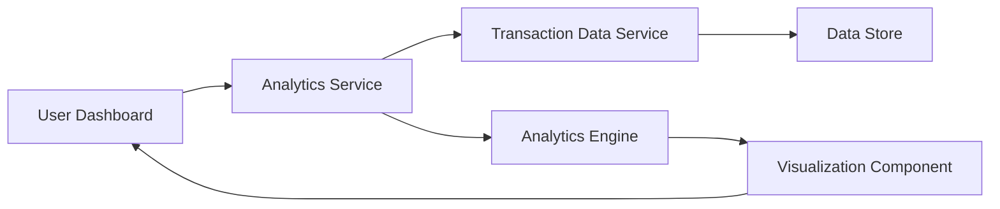

#### 1. High-Level Design

- **Summary**: This epic provides interactive spending analytics capabilities that visualize user expenses across nine predefined categories (Food & Dining, Fuel, Shopping, Travel, Entertainment, Utilities, Healthcare, Education, Miscellaneous). The system analyzes spending patterns through category-wise breakdowns, monthly trend analysis, and card-wise spend comparisons using interactive charts and graphs with drill-down capabilities.

- **Component Flow**:

- **Integration Points**: 
  - **Upstream**: Transaction data service (retrieves spending records), Analytics engine (aggregates and categorizes transactions)
  - **Downstream**: Interactive visualization components (charts/graphs) rendered in user interface

- **Key Assumptions**: 
  - Historical transaction data is retained for at least 12 months in accessible format
  - Analytics engine pre-aggregates data periodically to meet 3-second rendering requirement

- **NFR Highlights**: Visualizations render within 3 seconds; interactive charts with drill-down support; handles 12+ months of historical data

#### 2. Validation Report

- **Requirements Coverage**: The design fully covers category-wise visualization, monthly trends, card-wise analysis, and interactive charting across nine spending categories. The architecture separates analytics processing from visualization rendering to meet performance requirements. The analytics engine component ensures data aggregation efficiency, while the visualization layer provides interactive drill-down capabilities as specified.