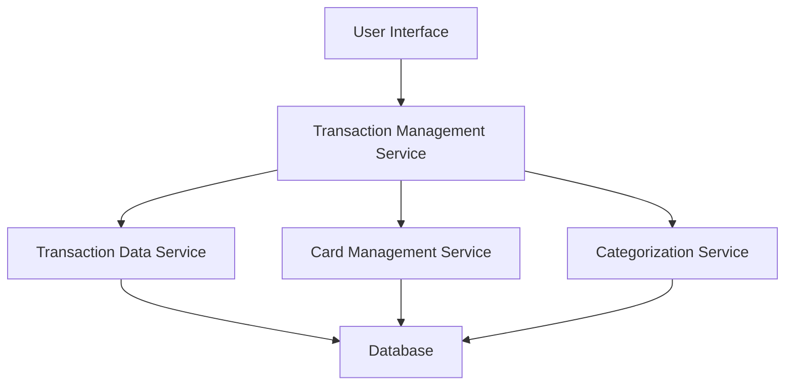

#### 1. High-Level Design

- **Summary**: This epic delivers a comprehensive transaction management interface that enables users to view, search, and filter credit card transactions across multiple cards. The system aggregates transaction data from various cards, displays detailed transaction information (date, merchant, amount, category), and provides responsive UI capabilities for transaction monitoring and spending history tracking.

- **Component Flow**:

- **Integration Points**: 
  - **Upstream**: Transaction data service (retrieves transaction records), Card management service (links transactions to cards), Categorization service (assigns spending categories)
  - **Downstream**: Responsive web/mobile interface for user interaction

- **Key Assumptions**: 
  - Transaction data is provided in a standardized format (JSON/REST API) by the transaction data service
  - Categorization service uses predefined rules or ML models to auto-assign categories to transactions

- **NFR Highlights**: Transaction list pagination for performance; search results within 1 second; real-time or minimal delay transaction display; responsive across all devices

#### 2. Validation Report

- **Requirements Coverage**: The design addresses all core requirements including transaction list display, detail views, multi-card aggregation, search/filtering, categorization, and responsive interface. The component architecture supports the stated NFRs through pagination, optimized search indexing, and real-time data synchronization. Integration dependencies are clearly mapped to upstream services.