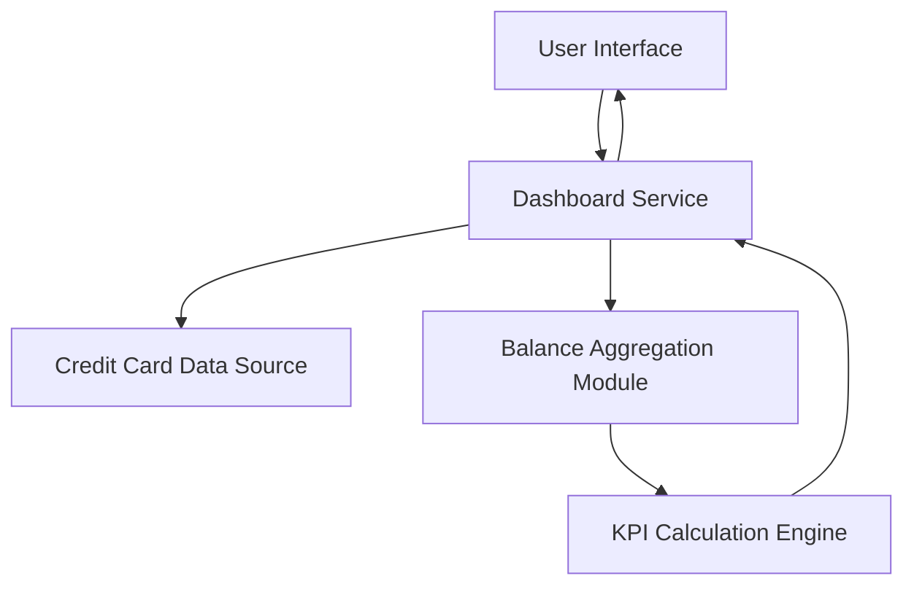

#### 1. High-Level Design

- **Summary**: This epic delivers a consolidated, responsive dashboard that displays four key performance indicators (Monthly Spend, Total Credit Limit, Available Credit, Outstanding Amount) providing users with an at-a-glance view of their overall credit card financial health across their entire card portfolio.

- **Component Flow**:

- **Integration Points**: 
  - Upstream: Credit card data source (provides real-time balance and transaction data)
  - Internal: Balance aggregation module (consolidates data across multiple cards)
  - Internal: KPI calculation engine (computes the four KPI metrics)

- **Key Assumptions**: 
  - Credit card data source provides near real-time balance updates with acceptable latency for dashboard display
  - KPI calculations aggregate data across all user cards to show portfolio-level metrics

- **NFR Highlights**: Dashboard must be responsive across desktop, tablet, and mobile devices; Page load time should be optimized for quick KPI rendering

#### 2. Validation Report

- **Requirements Coverage**: The design fully covers all requirements including the dashboard interface with all four KPIs (Monthly Spend, Total Credit Limit, Available Credit, Outstanding Amount) and responsive layout design. The architecture properly integrates with the credit card data source for real-time balance and transaction aggregation as specified in dependencies. The design addresses NFR requirements for responsive design across multiple device types and optimized page load time for quick KPI rendering.