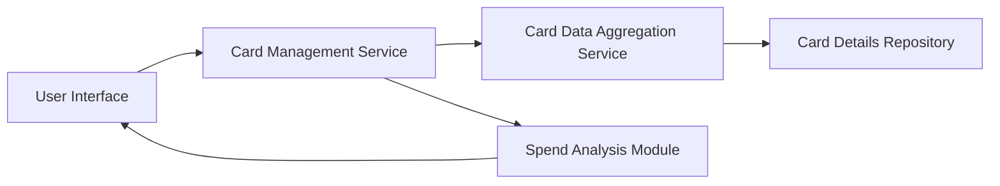

#### 1. High-Level Design

- **Summary**: This epic provides a unified interface for managing and monitoring multiple credit cards (up to 10 per user) within a single consolidated view, enabling users to view card details, perform card-wise spend analysis, and eliminate the need to access separate banking portals for each card.

- **Component Flow**:

- **Integration Points**: 
  - Upstream: Card data aggregation service (fetches and consolidates information from multiple card sources)
  - Internal: Card details repository (stores card information)
  - Internal: Spend analysis module (performs card-wise spending calculations)

- **Key Assumptions**: 
  - Card data aggregation service provides standardized card data format across different card sources
  - User can link/add cards through a separate onboarding process not defined in this epic

- **NFR Highlights**: System must support management of at least 10 credit cards per user; Card data retrieval must be efficient to prevent performance degradation

#### 2. Validation Report

- **Requirements Coverage**: The design addresses all core requirements including multiple credit card display, card-wise spend analysis, card details view, and card selection/filtering capabilities. The architecture properly integrates with the card data aggregation service as specified in dependencies. The design accounts for the NFR requirement to support at least 10 cards per user with efficient data retrieval to maintain performance.