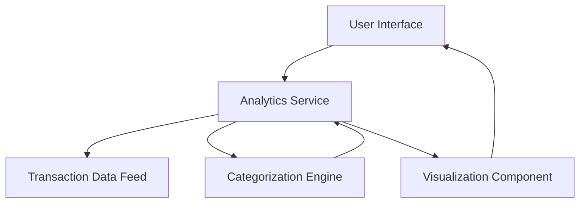

#### 1. High-Level Design

- **Summary**: This epic delivers interactive spending analytics capabilities that enable users to visualize and analyze their credit card spending patterns through monthly trend charts and category-wise breakdowns across 9 predefined categories (Food & Dining, Fuel, Shopping, Travel, Entertainment, Utilities, Healthcare, Education, Miscellaneous).

- **Component Flow**:

- **Integration Points**: 
  - Upstream: Transaction data feed (provides raw transaction data)
  - Upstream: Categorization engine (classifies transactions into 9 spending categories)
  - Downstream: Visualization component (renders interactive charts and graphs)

- **Key Assumptions**: 
  - Transaction data feed provides transactions with sufficient metadata (amount, date, merchant) for categorization
  - Historical transaction data is available for at least 12 months for meaningful trend analysis

- **NFR Highlights**: Analytics visualizations must render within 2 seconds; System must handle historical transaction data; Charts must be interactive and responsive

#### 2. Validation Report

- **Requirements Coverage**: The design covers all stated requirements including monthly spend trends visualization, category-wise spending analysis across 9 categories, interactive charts, and spending pattern identification. The architecture addresses the NFR requirements for 2-second rendering, historical data handling, and responsive interactive charts. Dependencies on transaction data feed and categorization engine are properly identified and integrated into the component flow.