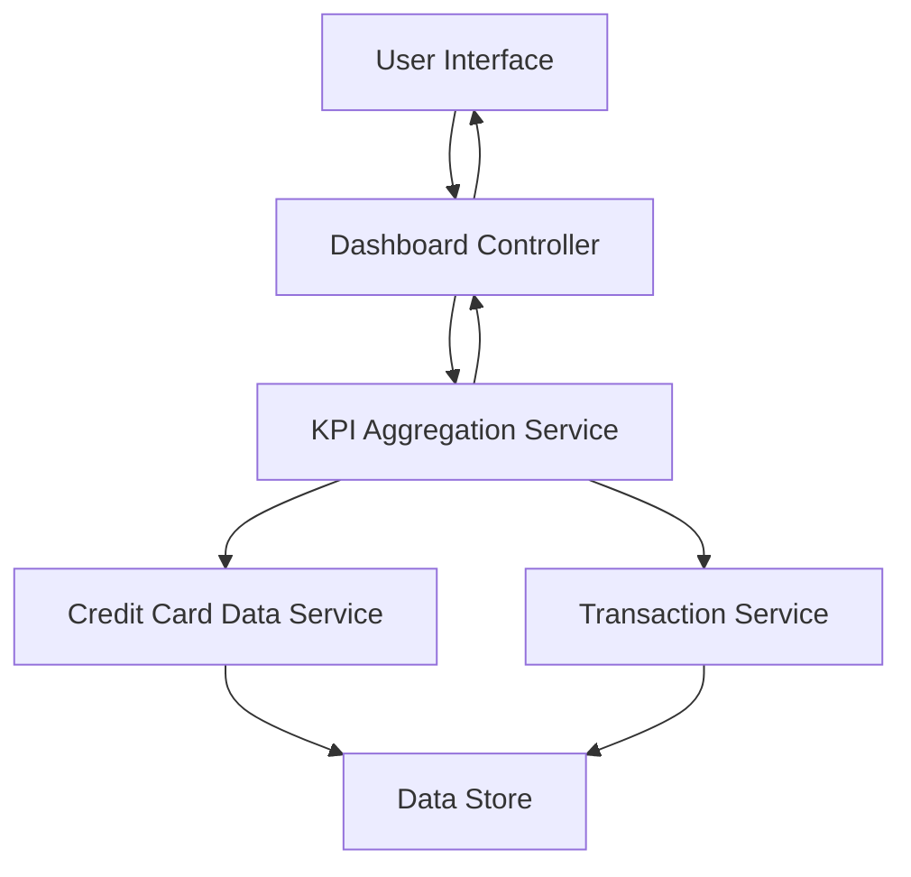

#### 1. High-Level Design

- **Summary**: This epic delivers a consolidated dashboard that displays key performance indicators (KPIs) across the user's entire credit card portfolio. The dashboard provides real-time visibility into monthly spend, total credit limit, available credit, and outstanding amounts through a modern, responsive interface that works seamlessly across desktop, tablet, and mobile devices.

- **Component Flow**:

- **Integration Points**: 
  - **Upstream**: Credit Card Data Service (provides card balances and credit limits)
  - **Upstream**: Transaction Service (calculates monthly spend and outstanding amounts)
  - **Internal**: KPI Aggregation Service (consolidates multi-card data)

- **Key Assumptions**: 
  - KPI calculations are performed server-side with results cached for performance optimization
  - Real-time data refresh is triggered on-demand by user action or periodic polling rather than push notifications

- **NFR Highlights**: Dashboard must be responsive across desktop, tablet, and mobile devices; KPI data must load within 2 seconds; System must support real-time data refresh

#### 2. Validation Report

- **Requirements Coverage**: The design comprehensively covers all KPI requirements including monthly spend display, total credit limit tracking, available credit calculation, outstanding amount visibility, and consolidated multi-card view. The architecture supports the critical 2-second load time NFR through the KPI Aggregation Service which can implement caching and pre-computation strategies. The responsive layout requirement is addressed through the UI layer, and real-time refresh capability is supported via the Dashboard Controller. Dependencies on Credit Card Data Service and Transaction Service are properly integrated into the component flow.