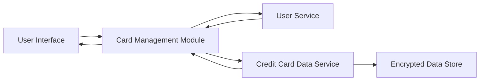

#### 1. High-Level Design

- **Summary**: This epic provides comprehensive credit card portfolio management functionality allowing users to add, view, and monitor multiple credit cards (up to 20 per user) within a single consolidated interface. Each card displays essential information including card type, credit limit, available credit, and outstanding balance, providing users with a unified view of their entire credit card portfolio.

- **Component Flow**:

- **Integration Points**: 
  - **Upstream**: User Service (handles user authentication and card ownership validation)
  - **Upstream**: Credit Card Data Service (stores and retrieves card information)
  - **Internal**: Encryption service for secure card data storage

- **Key Assumptions**: 
  - Card data is manually entered by users or imported via a secure upload mechanism (not real-time bank integration)
  - Card information updates are user-initiated rather than automatically synchronized with banks

- **NFR Highlights**: System must support up to 20 credit cards per user; Card data must be securely stored with encryption; Interface must be responsive across all device types

#### 2. Validation Report

- **Requirements Coverage**: The design addresses all stated requirements including multi-card display (up to 20 cards), card information viewing (type, limits, balances), card-wise spend analysis, and portfolio overview. The architecture incorporates User Service for authentication/validation and Credit Card Data Service for secure storage, meeting the NFR requirements for security (encryption) and capacity (20 cards per user). The responsive interface requirement is supported through the UI layer design. The explicit exclusion of real bank integration aligns with the out-of-scope items.