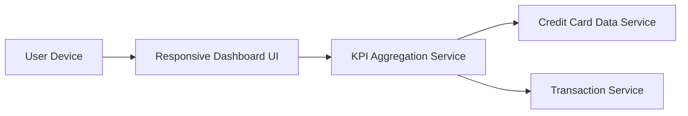

#### 1. High-Level Design

**Summary:** This epic creates a consolidated dashboard displaying key performance indicators across all user credit cards. It provides real-time visibility into monthly spend, total credit limit, available credit, and outstanding amounts through a modern, responsive interface accessible across all devices.

**Component Flow:**

**Integration Points:**
- **Upstream:** Credit Card Data Service (retrieves card details, balances, and credit limits)
- **Upstream:** Transaction Service (calculates monthly spend and outstanding amounts)
- **Internal:** KPI Aggregation Service (consolidates data from multiple sources)

**Key Assumptions:**
- Monthly spend is calculated based on the current calendar month, with transaction dates determining inclusion in the calculation.
- Available credit is computed as Total Credit Limit minus Outstanding Amount, assuming real-time or near-real-time data synchronization.

**NFR Highlights:** Dashboard must load within 2 seconds; System supports responsive design for mobile, tablet, and desktop devices; UI must be accessible and comply with WCAG 2.1 standards.

#### 2. Validation Report

**Requirements Coverage:** The design comprehensively covers all dashboard KPIs (Monthly Spend, Total Credit Limit, Available Credit, Outstanding Amount) and multiple credit card view requirements. The responsive UI component ensures cross-device compatibility as specified. The KPI Aggregation Service consolidates data from both Credit Card Data Service and Transaction Service, meeting all stated dependencies. The 2-second load time requirement is addressed through efficient aggregation and caching strategies. WCAG 2.1 compliance is a design constraint for the UI layer.