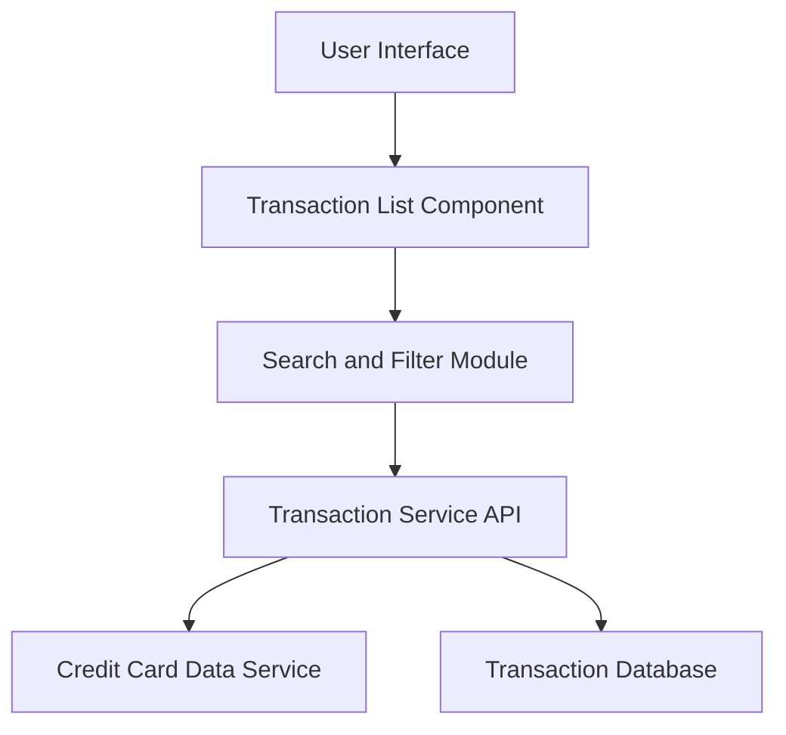

#### 1. High-Level Design

**Summary:** This epic provides comprehensive transaction viewing and monitoring capabilities across multiple credit cards. Users can access detailed transaction histories, search and filter transactions, and track individual purchases to maintain financial awareness and control.

**Component Flow:**

**Integration Points:**
- **Upstream:** Transaction Service (retrieves transaction data with pagination support)
- **Upstream:** Credit Card Data Service (maps transactions to specific credit cards)
- **Internal:** Transaction Database (stores transaction records)

**Key Assumptions:**
- Transactions are stored with card identifiers to enable multi-card aggregation and filtering.
- Search and filter operations are performed server-side to handle large datasets efficiently with pagination.

**NFR Highlights:** Transaction list supports pagination for large datasets; Transaction retrieval API responds within 500ms; System handles at least 10,000 transactions per user.

#### 2. Validation Report

**Requirements Coverage:** The design fully addresses the epic's scope including transaction list view, transaction details display, multi-card aggregation, and search/filter capabilities. The architecture incorporates pagination to meet the NFR for handling large datasets, and the API layer is designed to meet the 500ms response time requirement. The Credit Card Data Service integration ensures proper mapping of transactions to cards. The 10,000 transactions per user requirement is supported through pagination and efficient database queries.