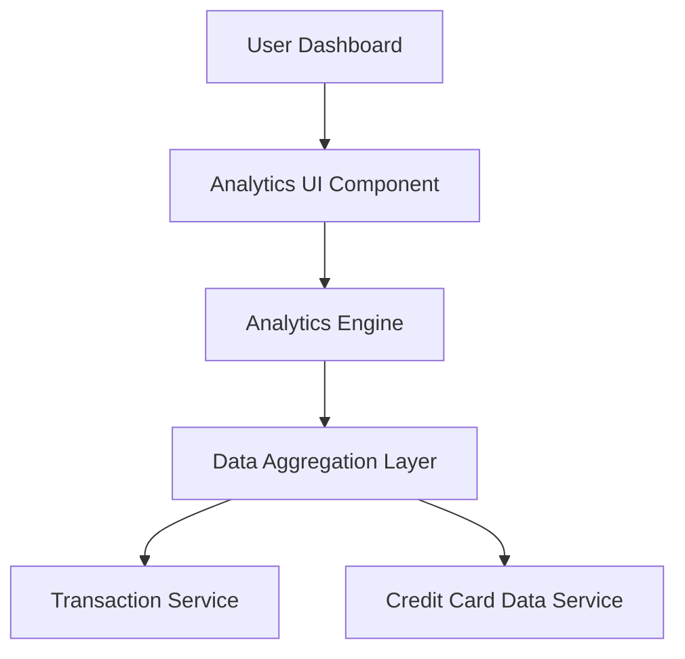

#### 1. High-Level Design

**Summary:** This epic delivers interactive analytics and visualization capabilities to help users understand spending patterns across their credit cards. It provides monthly spend trends, card-wise spending analysis, and category-wise spending breakdown across nine predefined categories, enabling data-driven financial decisions.

**Component Flow:**

**Integration Points:**
- **Upstream:** Transaction Service (provides historical transaction data for analysis)
- **Upstream:** Credit Card Data Service (provides card-specific spending data)
- **Internal:** Analytics Engine (performs data aggregation and categorization)

**Key Assumptions:**
- Transaction data is pre-categorized into the nine specified categories by the Transaction Service or categorization logic exists in the Analytics Engine.
- Monthly aggregation is calculated based on transaction date timestamps, assuming consistent date format across all transactions.

**NFR Highlights:** Analytics visualizations must render within 3 seconds; Charts must be interactive with drill-down capabilities; System must handle data aggregation for up to 12 months of historical data.

#### 2. Validation Report

**Requirements Coverage:** The design covers all stated requirements including monthly spend trends, card-wise analysis, and category-wise spending across nine categories. The component flow ensures data flows from transaction and card services through an aggregation layer to the analytics engine, which feeds interactive visualizations. The 3-second rendering requirement and 12-month historical data handling are addressed through the data aggregation layer. All specified dependencies (Transaction Service, Analytics Engine, Credit Card Data Service) are incorporated into the architecture.