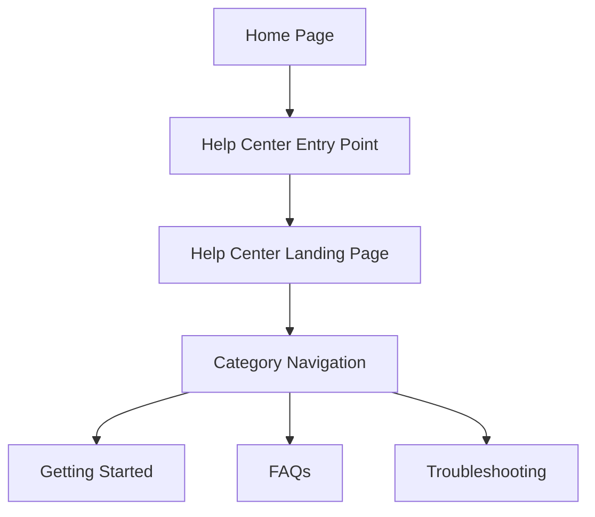

#### 1. High-Level Design

- **Summary**: This epic enables users to access a dedicated Help Center directly from the Home Page through a prominent entry point with a landing page that organizes support resources into logical categories (Getting Started, FAQs, Troubleshooting). The implementation provides full responsive design across all devices, maintains existing Home Page functionality, and ensures WCAG 2.1 AA accessibility compliance with branded visual alignment.

- **Component Flow**:

- **Integration Points**: 
  - Existing website infrastructure and CMS (integration)
  - Existing Home Page layout and navigation system (integration)
  - Website branding guidelines and design system (upstream)

- **Key Assumptions**: 
  - Help Center entry point added to main navigation bar as new menu item; does not replace existing navigation elements
  - Category organization uses static navigation structure; categories are not dynamically generated

- **NFR Highlights**: Landing page loads within 2 seconds on broadband, 4 seconds on mobile; supports 100,000 concurrent users; 99.9% uptime; WCAG 2.1 AA compliant with keyboard navigation and screen reader support; HTTPS-only

#### 2. Validation Report

- **Requirements Coverage**: The design covers all stated requirements including Help Center entry point on Home Page, dedicated landing page, categorized content organization (Getting Started, FAQs, Troubleshooting), responsive design for desktop/tablet/mobile, branding and accessibility compliance (WCAG 2.1 AA), and navigation without disrupting existing Home Page functionality. The component flow demonstrates clear user path from Home Page through entry point to landing page and category-based navigation. All NFRs for performance (2-4 second load), scalability (100K users), reliability (99.9% uptime), accessibility, and security are addressed.