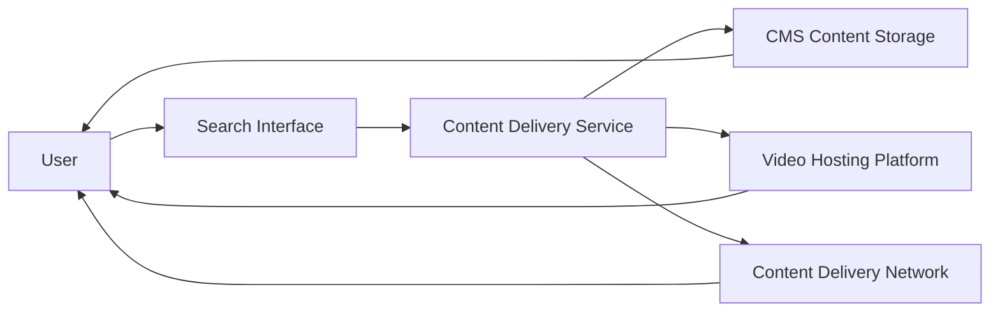

#### 1. High-Level Design

- **Summary**: This epic provides comprehensive access to multiple content types (text articles, FAQs, embedded videos, downloadable materials) with keyword search functionality across all Help Center content. The system includes robust error handling, secure content delivery over HTTPS, and supports 100,000 concurrent users with performance targets of 2-second content load and 3-second video playback.

- **Component Flow**:

- **Integration Points**: 
  - Video hosting platform for tutorials (upstream)
  - Content delivery network for downloadable materials (upstream)
  - Existing CMS for content storage (integration)
  - Editorial team for content creation and maintenance (upstream)

- **Key Assumptions**: 
  - Search uses keyword-based indexing with basic relevance ranking; no advanced semantic search
  - Video tutorials are pre-encoded and hosted externally; platform handles adaptive bitrate streaming

- **NFR Highlights**: Content loads within 2 seconds on broadband; video plays within 3 seconds; file downloads begin within 2 seconds; search results within 2 seconds; HTTPS-only; supports 100,000 concurrent users

#### 2. Validation Report

- **Requirements Coverage**: The design covers all stated requirements including text articles/FAQs display, embedded video player, downloadable materials functionality, keyword search with 2-second response, error handling with fallback messaging, and secure HTTPS delivery. The component flow shows how users interact with the search interface, which queries the content delivery service that orchestrates access to CMS storage, video hosting platform, and CDN for different content types. Performance, security, and scalability NFRs are explicitly addressed.