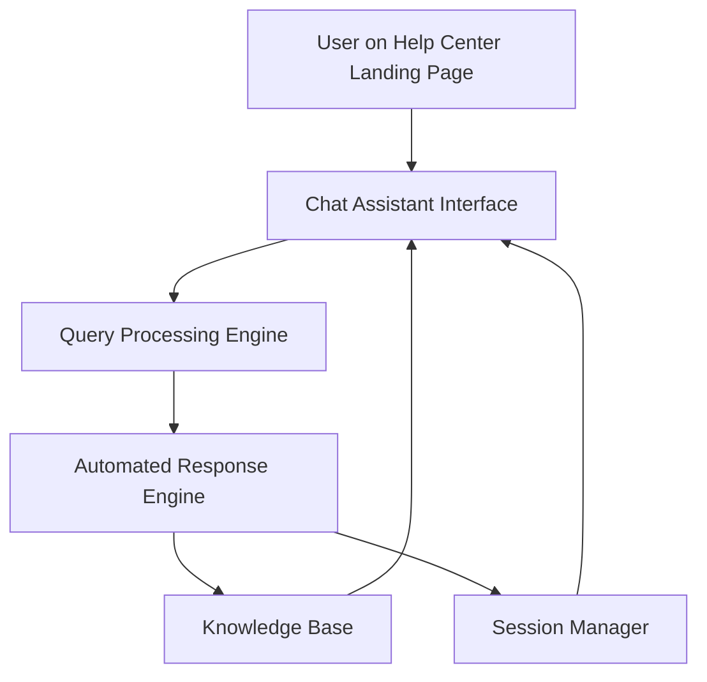

#### 1. High-Level Design

- **Summary**: This epic delivers an interactive chat assistant accessible from the Help Center landing page that provides automated real-time support to users. The system handles up to 10,000 simultaneous chat sessions, responds to user queries with relevant information, and maintains secure, accessible interactions across all devices.

- **Component Flow**:

- **Integration Points**: 
  - Chat assistant technology platform (upstream)
  - Help Center knowledge base (upstream)
  - Existing website infrastructure (integration)
  - Analytics platform for tracking interactions (downstream)

- **Key Assumptions**: 
  - Chat assistant uses pre-configured automated responses from a knowledge base; no AI/ML natural language processing beyond basic pattern matching
  - Session management uses standard web session tokens with 30-minute timeout

- **NFR Highlights**: Chat window opens within 2 seconds; supports 10,000 simultaneous sessions; 99.9% uptime; WCAG 2.1 AA compliant; HTTPS-only; no sensitive data exposure

#### 2. Validation Report

- **Requirements Coverage**: The design covers all stated requirements including chat interface, automated response engine, session management, query processing, accessibility features, mobile responsiveness, security (HTTPS, no sensitive data exposure), performance targets (2-second load, 10K concurrent sessions), and 99.9% uptime. The component flow demonstrates how user queries are processed through the query engine, matched against the knowledge base, and returned via the response engine while the session manager handles concurrent sessions.