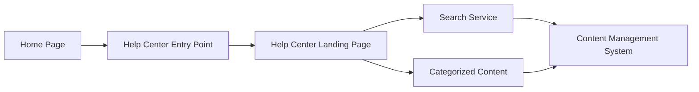

#### 1. High-Level Design

- **Summary**: Enables users to access a centralized Help Center from the Home Page through a prominent entry point in main navigation. Users land on a dedicated Help Center page with categorized content (Getting Started, FAQs, Troubleshooting), search functionality, and responsive design across all devices. The system must support up to 100,000 concurrent users and meet WCAG 2.1 AA accessibility standards.

- **Component Flow**:

- **Integration Points**: 
  - Upstream: Existing website infrastructure, Home Page main navigation
  - Downstream: Content Management System (CMS) for content delivery, search service for help content search
  - Content Source: Editorial team for content creation and maintenance
  - Security: All content served over HTTPS

- **Key Assumptions**: 
  - Existing CMS supports API access for retrieving categorized content and search indexing
  - Responsive design framework is already established in existing website infrastructure for consistency

- **NFR Highlights**: Help Center landing page must load within 2 seconds on broadband and 4 seconds on mobile; Must support up to 100,000 concurrent users without degradation; Must maintain 99.9% uptime with automated fallback; Must meet WCAG 2.1 AA accessibility standards including keyboard navigation and screen reader support; All content served over HTTPS

#### 2. Validation Report

- **Requirements Coverage**: The design addresses all requirements including Help Center entry point on Home Page, dedicated landing page, categorized content organization (Getting Started, FAQs, Troubleshooting), responsive design for all devices, branding and accessibility compliance, search functionality, and meaningful error messages. The component flow demonstrates clear navigation path and integration with CMS and search services.

- **NFR Validation**: Performance requirements (2-second load on broadband, 4-second on mobile), scalability (100,000 concurrent users), availability (99.9% uptime with automated fallback), accessibility (WCAG 2.1 AA with keyboard navigation and screen reader support), and security (HTTPS) are explicitly captured and addressed.

- **Dependency Coverage**: All dependencies are identified including existing website infrastructure, CMS, and editorial team. Integration points are clearly mapped in the component flow.

- **Out of Scope Confirmation**: Backend CMS enhancements, live human chat support, third-party integrations beyond video player and chat assistant, user feedback, personalized recommendations, and bookmarking functionality are correctly excluded from scope.

- **Business Impact**: Expected to reduce support tickets by 20% and increase self-service resolution rate by 30% within 3 months, providing measurable value to the organization.