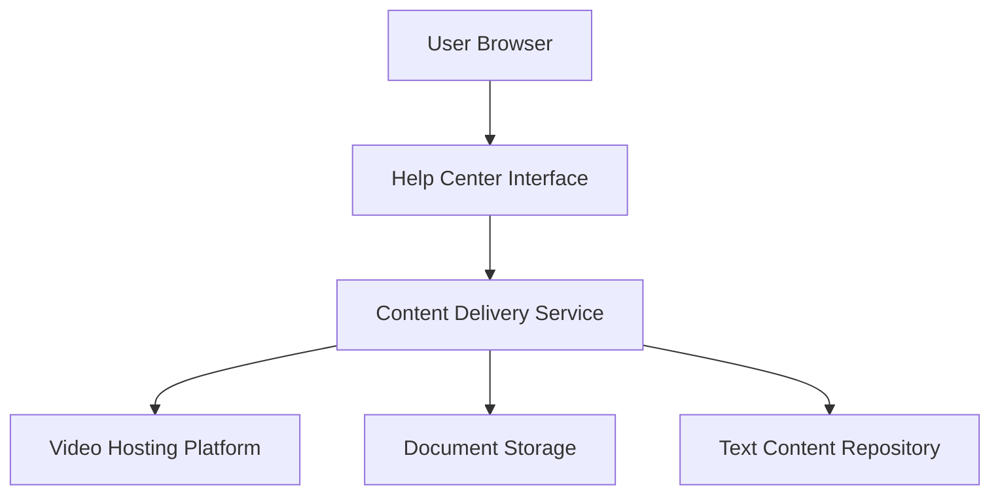

#### 1. High-Level Design

- **Summary**: Delivers comprehensive help content in multiple formats including text-based articles/FAQs viewable within the interface, embedded video tutorials with playback controls, and downloadable materials (user guides, PDFs, training documents). The system handles content unavailability gracefully and supports up to 100,000 concurrent users accessing content simultaneously.

- **Component Flow**:

- **Integration Points**: 
  - Upstream: Existing website infrastructure for content delivery, Help Center interface
  - Downstream: Video hosting platform for tutorials, document storage for downloadable materials, text content repository for articles/FAQs
  - Content Source: Editorial team for content creation and updates
  - Security: All content served over HTTPS

- **Key Assumptions**: 
  - Video hosting platform supports embedded playback with standard controls and provides CDN for performance
  - Content filtering by category/type implies existing taxonomy or metadata structure in content repository

- **NFR Highlights**: Video player must load and play within 3 seconds; File downloads must begin within 2 seconds; Must support up to 100,000 concurrent users; Video and downloadable content must not impact page load times beyond 2-4 second targets; All content served over HTTPS

#### 2. Validation Report

- **Requirements Coverage**: The design covers all content delivery requirements including text-based articles/FAQs, embedded video tutorials with playback controls, downloadable materials (PDFs, user guides, training documents), graceful error handling, support for multiple content types, and content filtering by category/type. The component flow demonstrates separation of concerns with dedicated services for video, documents, and text content.

- **NFR Validation**: Performance requirements (3-second video load, 2-second download initiation, 2-4 second page load), scalability (100,000 concurrent users), and security (HTTPS for all content) are explicitly addressed in the design.

- **Dependency Coverage**: All dependencies are identified including video hosting platform, existing website infrastructure, and editorial team for content management. Integration points are clearly mapped in the component flow.

- **Out of Scope Confirmation**: Backend CMS enhancements, user feedback on articles, personalized content recommendations, and bookmarking functionality are correctly excluded from scope.