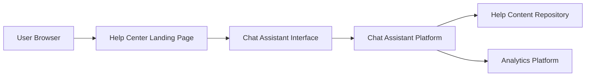

#### 1. High-Level Design

- **Summary**: Provides an interactive chat assistant accessible from the Help Center landing page that offers real-time automated support, responds to user queries with relevant information, provides contextual links to help articles, and tracks all interactions for analytics. The system must support up to 10,000 simultaneous chat sessions while maintaining performance standards.

- **Component Flow**:

- **Integration Points**: 
  - Upstream: Existing website infrastructure, Help Center landing page
  - Downstream: Chat assistant technology platform, help content repository for linking relevant articles, analytics platform for tracking interactions
  - Security: All chat interactions served over HTTPS

- **Key Assumptions**: 
  - Chat assistant platform provides API for integration with contextual query handling and response generation
  - Help content repository has structured metadata enabling dynamic linking based on conversation context

- **NFR Highlights**: Chat window must open within 2 seconds; Must support up to 10,000 simultaneous chat sessions without degradation; Must maintain 99.9% uptime; Must meet WCAG 2.1 AA accessibility standards; Chat assistant must not expose sensitive user data

#### 2. Validation Report

- **Requirements Coverage**: The design addresses all stated requirements including interactive chat interface, automated response capability, contextual linking to help articles, real-time query handling, session tracking for analytics, and support for 10,000 simultaneous sessions. The component flow demonstrates integration with help content repository for contextual responses and analytics platform for interaction tracking.

- **NFR Validation**: Performance requirements (2-second chat window open time), scalability (10,000 simultaneous sessions), security (HTTPS, no sensitive data exposure), availability (99.9% uptime), and accessibility (WCAG 2.1 AA) are explicitly captured and addressed in the design.

- **Dependency Coverage**: All dependencies are identified including chat assistant technology platform, existing website infrastructure, help content repository, and analytics platform. Integration points are clearly mapped in the component flow.

- **Out of Scope Confirmation**: Live human chat support, third-party integrations beyond chat assistant technology, and advanced AI capabilities are correctly excluded from scope.