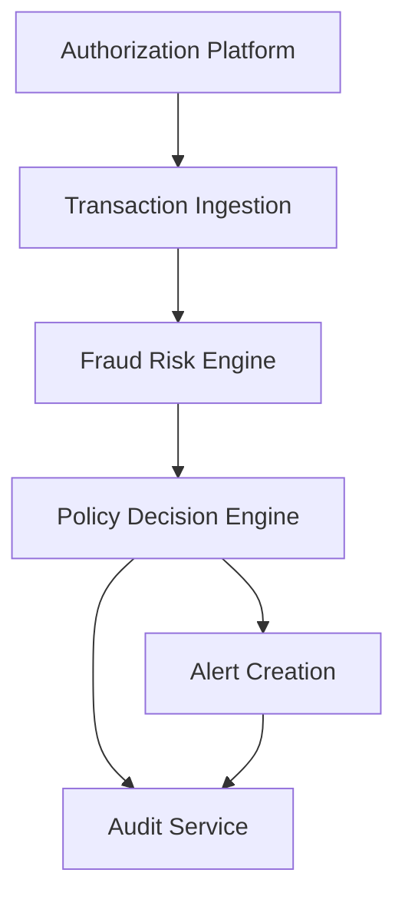

#### 1. High-Level Design

- **Summary**: This epic implements the core fraud detection engine that ingests transaction events from the authorization platform, evaluates risk using scoring models and multiple signals, classifies transactions into risk bands, and determines appropriate actions through a policy engine based on configurable thresholds.

- **Component Flow**:

- **Integration Points**:
  - Upstream: Card authorization/transaction platform for transaction events
  - Upstream: Fraud-risk engine/model for scoring
  - Upstream: Policy/decision engine for threshold-based actions
  - Downstream: Analytics and audit infrastructure for event capture
  - Stakeholder: Security and compliance stakeholders for policy approval

- **Key Assumptions**:
  - Transaction events arrive in a consistent schema with required fields (transaction_id, account_id, card_id, merchant, amount, currency, timestamp)
  - Risk thresholds are externally configurable without requiring code deployment

- **NFR Highlights**: Transaction-time SLA for near-real-time risk evaluation and alert triggering; support for transaction spikes without unacceptable delays; high availability with defined disaster recovery; idempotency, retries, event versioning, and durable audit records; comprehensive observability with metrics, logs, traces, and dashboards; least privilege access

#### 2. Validation Report

- **Requirements Coverage**: The design addresses all core requirements including transaction event ingestion, risk score evaluation, configurable alert threshold management, policy decision mapping, transaction context capture, idempotency handling for duplicates, risk signal processing for unusual patterns, audit trail creation, and model version tracking and performance monitoring. All NFRs for transaction-time SLA, scalability under spikes, high availability, reliability mechanisms, observability, and security access controls are covered.