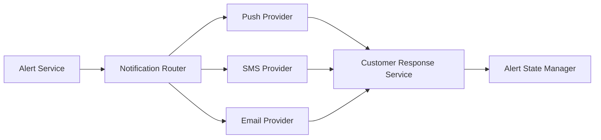

#### 1. High-Level Design

- **Summary**: This epic delivers the customer-facing notification and response experience for fraud alerts. It manages multi-channel alert delivery (push, SMS, email, in-app), presents transaction details in plain language, captures customer confirmation or reporting actions, and tracks alert lifecycle states from creation through resolution.

- **Component Flow**:

- **Integration Points**:
  - Upstream: Alert service for canonical alert record creation
  - Downstream: Notification providers for multi-channel delivery (push, SMS, email)
  - Upstream: Customer identity/authentication service for secure response actions
  - Downstream: Customer response service for authenticated decision capture
  - Downstream: Analytics infrastructure for event tracking

- **Key Assumptions**:
  - Notification providers support retry and delivery confirmation APIs
  - Customer preferences are stored and accessible with security override flags

- **NFR Highlights**: Near-real-time SLA from transaction event to alert delivery; high notification delivery success; accessibility across platforms; strong authentication for responses; encryption in transit and at rest; no full card numbers displayed; protected notification links; rate-limiting on sensitive endpoints

#### 2. Validation Report

- **Requirements Coverage**: The design covers all functional requirements including multi-channel notification delivery, transaction detail presentation with merchant/amount/time/masked card, customer confirmation and reporting actions, alert state management, authenticated response capture, delivery status tracking and retry logic, fallback channel support, preference management with security overrides, alert viewing, and alert grouping/prioritization. All NFRs for latency SLA, delivery success, accessibility, authentication, encryption, data protection, and rate-limiting are addressed.