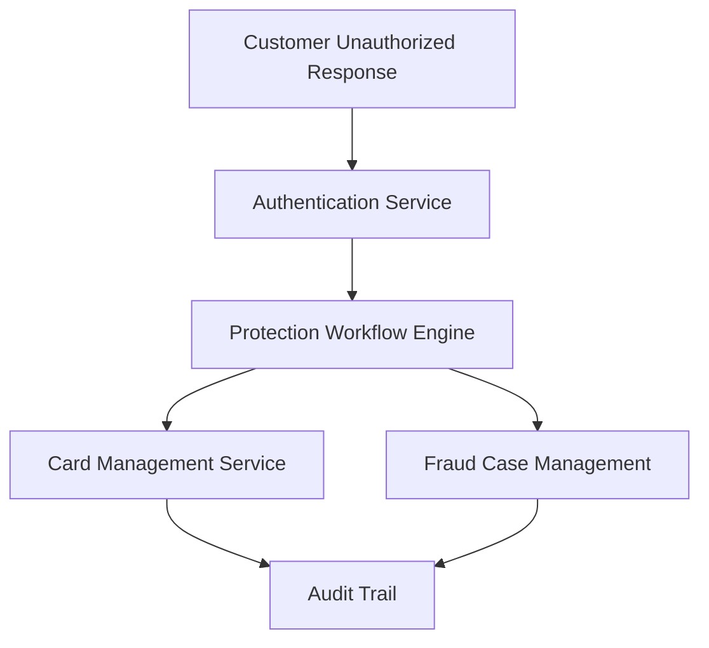

#### 1. High-Level Design

- **Summary**: This epic implements the security response workflows triggered when customers report unauthorized transactions. It handles card blocking, account protection, fraud case creation, investigation tracking, and dispute initiation to minimize financial harm and restore account security after fraud detection.

- **Component Flow**:

- **Integration Points**: 
  - Upstream: Customer identity/authentication service for step-up verification
  - Downstream: Card-management/protection service for blocking and replacement
  - Downstream: Fraud case-management system for investigation and disputes
  - Downstream: Customer-support systems for case resolution
  - Downstream: Audit infrastructure for security event logging

- **Key Assumptions**: 
  - Card blocking and replacement procedures are owned by the card-management service with defined APIs
  - Step-up authentication thresholds and methods are pre-configured in the identity service

- **NFR Highlights**: Complete unauthorized-report protection workflows within target operational SLA; high availability for security-critical protection services; strong authentication with step-up verification; zero critical security or privacy defects before GA

#### 2. Validation Report

- **Requirements Coverage**: The design addresses all stated requirements including unauthorized transaction reporting, card blocking execution, account protection triggers, fraud case creation and tracking, card replacement initiation, protection workflow status management, operations investigation interface, case-management integration, step-up authentication, protection action monitoring, audit trails, and edge case handling for post-block confirmations. All NFRs for SLA compliance, availability, authentication, least-privilege access, security event logging, and data retention are covered.