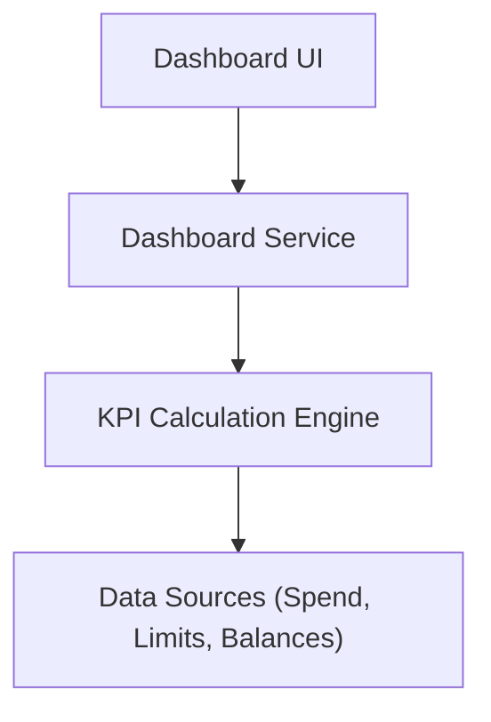

#### 1. High-Level Design
- Summary: The core requirement of this epic is to create a central dashboard that displays key financial KPIs, providing users with a quick, consolidated overview of their credit card metrics.
- Component Flow: 

- Integration Points: Not specified in epic.
- Key Assumptions: Assumes that the data sources for KPIs (total spend, credit limits, outstanding balances) are available and can be queried. Assumes a consistent definition for all KPIs.
- NFR Highlights: The dashboard must have a responsive layout.
#### 2. Validation Report
- Requirements Coverage: The design fulfills the epic's scope by creating a system to display "Dashboard KPIs" such as "Monthly Spend," "Total Credit Limit," and "Outstanding Amount."