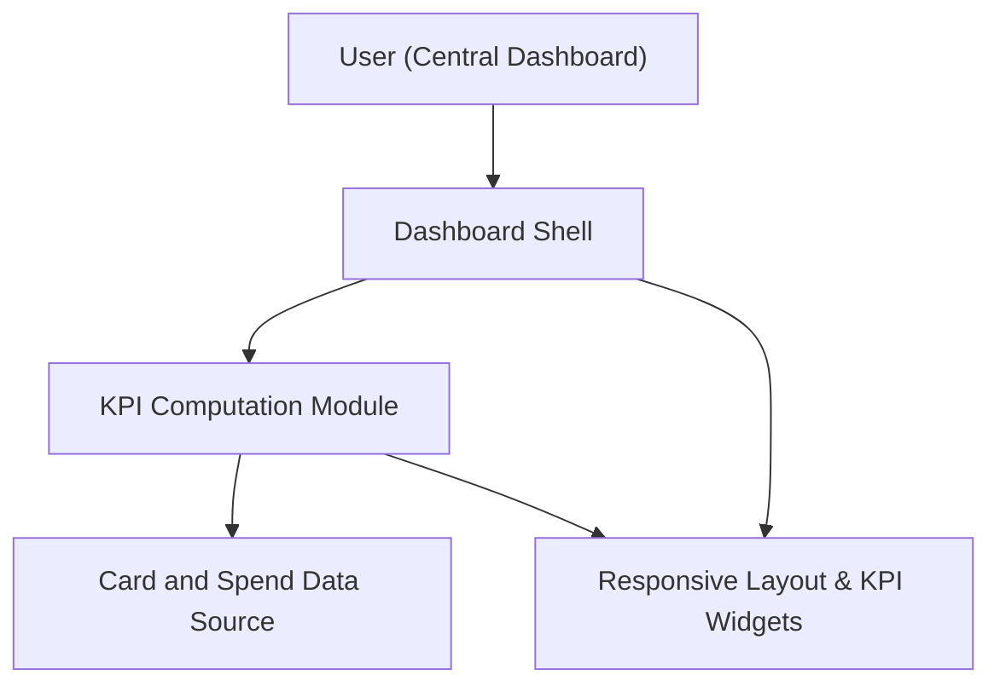

#### 1. High-Level Design
- Summary: Build a central dashboard providing consolidated KPIs (monthly spend, total credit limit, available credit, outstanding amount) across all credit cards for at-a-glance monitoring.
- Component Flow:

- Integration Points:
  - Shared card and spend data source feeding KPI computation
  - Reusable responsive layout and KPI widget components shared with other dashboard features
- Key Assumptions:
  - Dashboard KPIs reuse a common computation module also used by other KPI-related epics to ensure consistency.
  - Data is loaded from a mock or internal source and refreshed on dashboard load rather than in real time.
- NFR Highlights: Dashboard must have a responsive layout; no additional explicit performance or security NFRs are specified in this epic.

#### 2. Validation Report
- Requirements Coverage: The design provides consolidated KPIs on a responsive dashboard, aligning with the epic’s description and scope, and supports a unified KPI monitoring experience across cards.

---
