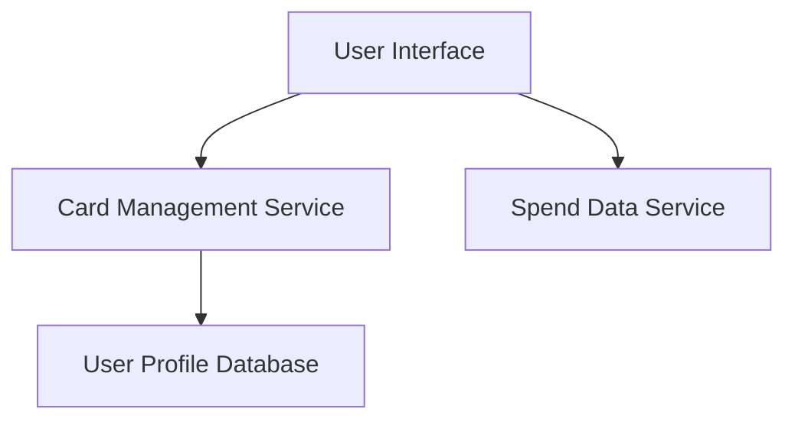

#### 1. High-Level Design
- Summary: This epic focuses on enabling users to add multiple credit cards to their profile and view high-level details for all of them in a single, centralized interface.
- Component Flow: 

- Integration Points: Not specified in epic.
- Key Assumptions: Assumes users will manually input their credit card information. Assumes the system will store a non-sensitive representation of the card (e.g., last 4 digits, card type).
- NFR Highlights: The interface must have a responsive layout.
#### 2. Validation Report
- Requirements Coverage: The design covers the core scope of adding "Multiple Credit Cards" and enabling "Card-wise Spend Analysis" by providing a central point of management.