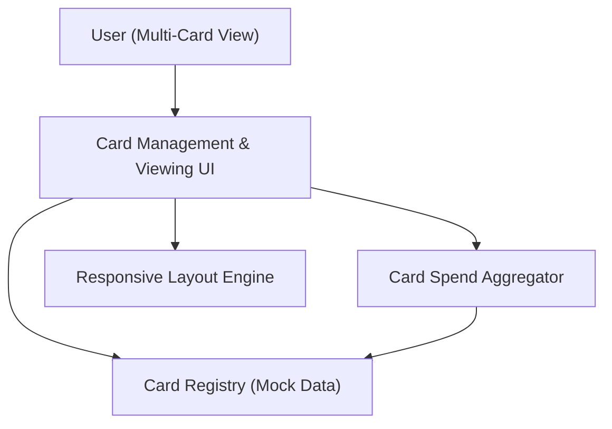

#### 1. High-Level Design
- Summary: Allow users to add and view multiple credit cards in a single interface, providing high-level card details and card-wise spend analysis.
- Component Flow:

- Integration Points:
  - Internal card registry (mock data) for storing and retrieving card definitions
  - Card spend aggregation logic to compute card-wise spend
- Key Assumptions:
  - Card-level spending is derived from a shared transaction dataset linked by card identifiers.
  - Multi-card view reuses a common responsive layout engine to ensure consistent viewing across form factors.
- NFR Highlights: Interface must have a responsive layout; other non-functional constraints are not specified in this epic.

#### 2. Validation Report
- Requirements Coverage: The design supports multi-card viewing, card-wise spend analysis, and a responsive interface, consistent with the epic’s scope and noted NFR.

---
