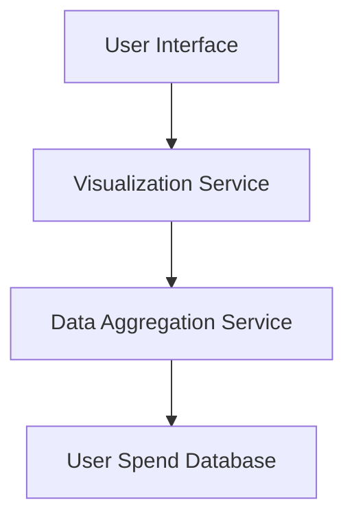

#### 1. High-Level Design
- Summary: This epic's core requirement is to build interactive visualizations that allow users to analyze their spending habits, focusing on monthly trends and breakdowns by category.
- Component Flow: 

- Integration Points: Not specified in epic.
- Key Assumptions: Assumes that categorized transaction data is available and accessible. Assumes user authentication is handled by a separate module.
- NFR Highlights: The interface must have a responsive layout.
#### 2. Validation Report
- Requirements Coverage: The design directly addresses the requirements for visualizing "Monthly Spend Trends" and "Category-wise Spending" as outlined in the epic's scope.