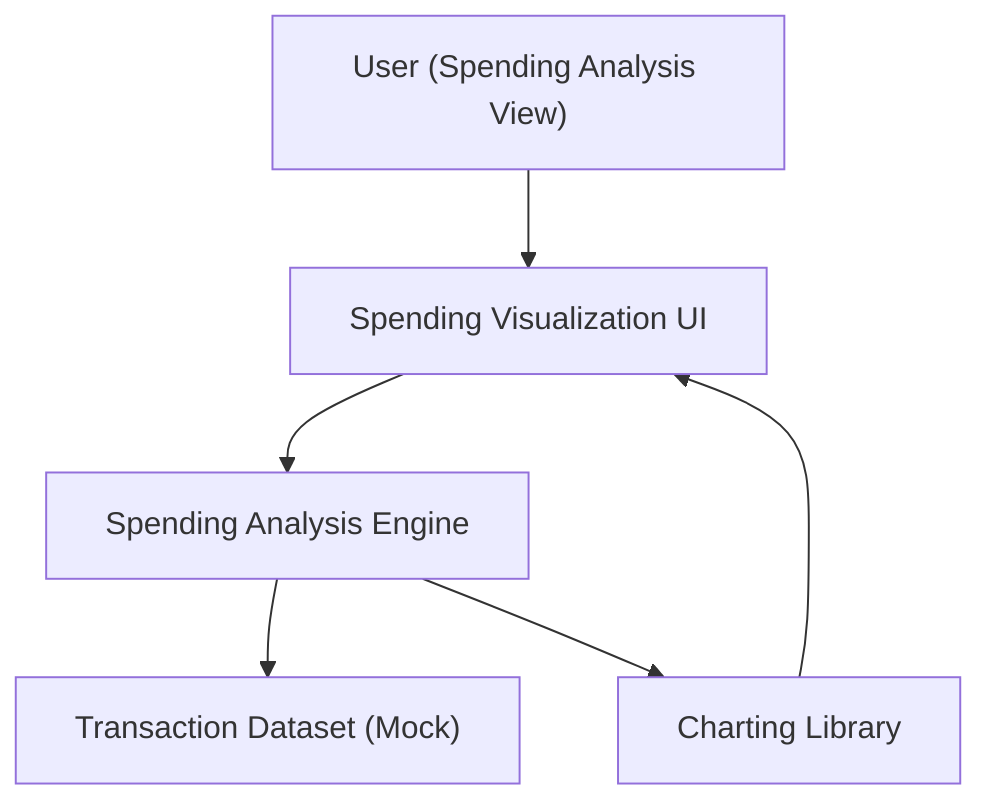

#### 1. High-Level Design
- Summary: Deliver interactive visualizations for monthly spend trends and category-wise spending to help users understand spending habits.
- Component Flow:

- Integration Points:
  - Charting library used to render interactive spending visualizations
  - Transaction dataset (mock) used to compute monthly trends and category splits
- Key Assumptions:
  - Transactions are already categorized, or a separate categorization process runs upstream prior to this analysis.
  - Monthly trends and category breakdowns are recalculated client-side when filters are applied, subject to typical volumes.
- NFR Highlights: Responsive layout is required for the interface; no further explicit NFRs are specified.

#### 2. Validation Report
- Requirements Coverage: The design delivers monthly trends, category-wise spending, and interactive visualizations over a responsive layout, matching the epic’s scope and NFR statements.

---
