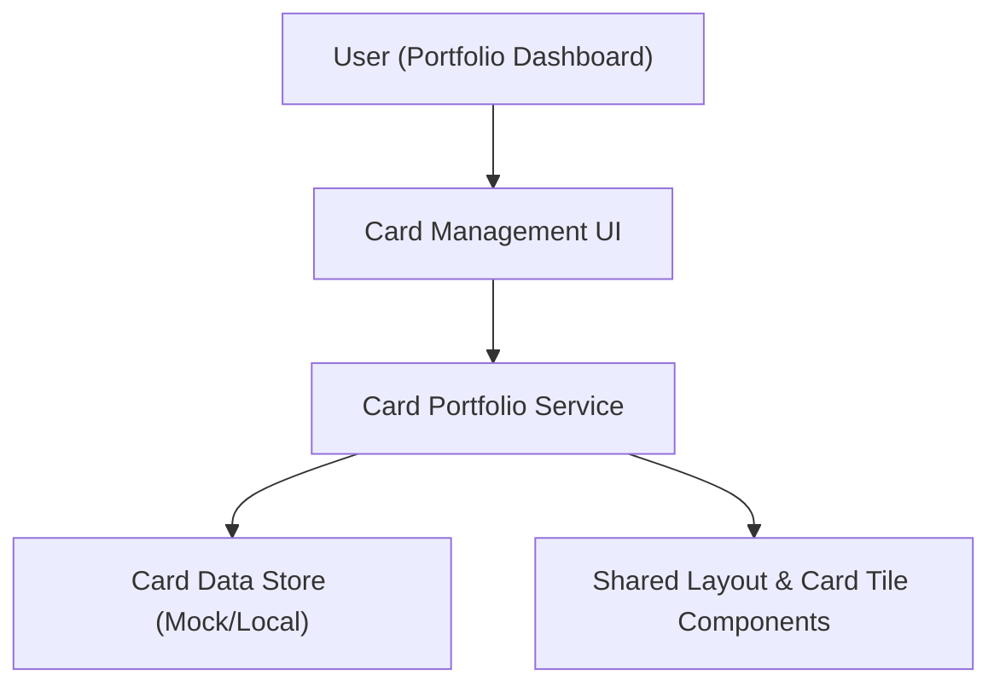

#### 1. High-Level Design
- Summary: Provide a unified, responsive dashboard to add, manage, and view multiple credit cards, showing card-level credit limit, available credit, and outstanding amount with basic metadata.
- Component Flow:

- Integration Points:
  - Internal data layer for card information storage and retrieval (mock or demo data)
  - Shared UI components for responsive layout and card tiles
- Key Assumptions:
  - Card records are persisted in a local/mock data store and can be loaded quickly to meet the 2-second render requirement.
  - Card metadata (issuer, card name, masked number) follows a standardized schema compatible with the shared card tile components.
- NFR Highlights: Card portfolio view must render within 2 seconds, with responsive layout and optimized client-side operations using mock/local data sources.

#### 2. Validation Report
- Requirements Coverage: The design supports multi-card management, card-level KPIs, responsive card tiles, and uses a mock data layer, aligning with the epic’s description, scope, and NFRs.

---
