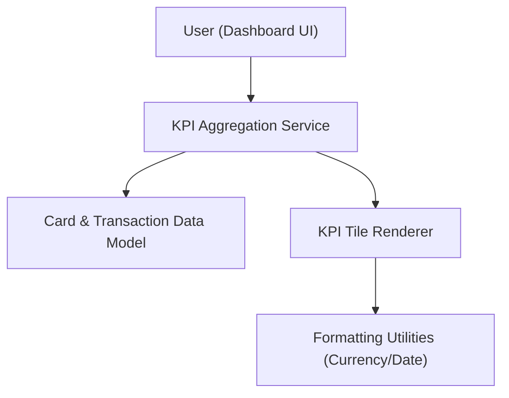

#### 1. High-Level Design
- Summary: Implement core dashboard KPIs (monthly spend, total credit limit, available credit, outstanding amount) aggregated across multiple cards and presented via responsive KPI tiles.
- Component Flow:

- Integration Points:
  - Internal card and transaction data models for KPI calculations
  - Shared UI framework for KPI tiles and dashboard layout
  - Reusable formatting utilities for currency and dates
- Key Assumptions:
  - All KPIs are computed client-side from a cached or mock dataset representing cards and transactions.
  - KPI tiles share a common UI component library to ensure consistent layout and responsiveness across devices.
- NFR Highlights: KPIs must calculate and display within 2 seconds for typical data volumes, maintain accuracy (standard rounding), and remain usable across desktop and mobile with support for dozens of cards and hundreds of transactions without noticeable lag.

#### 2. Validation Report
- Requirements Coverage: The design addresses KPI calculation, cross-card aggregation, responsive KPI tiles, and formatting dependencies, matching the epic’s scope and performance constraints.

---
