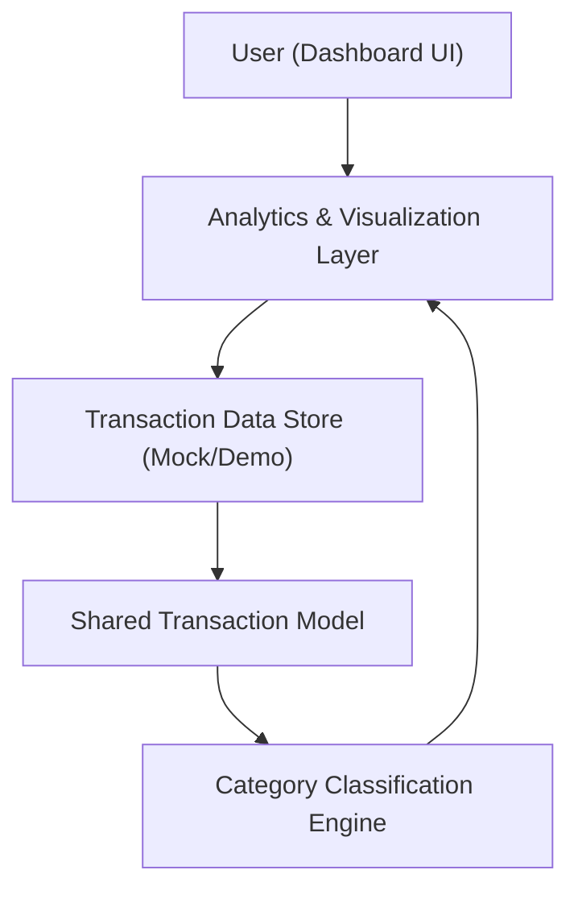

#### 1. High-Level Design
- Summary: Provide interactive analytics and visualizations for monthly spend trends, card-wise spend, and category-wise spending across defined categories, with filters and drill-down into transactions.
- Component Flow:

- Integration Points:
  - Internal transaction data store (mock/demo)
  - Shared transaction model used by dashboard and analytics
  - Shared category taxonomy and charting/visualization library
- Key Assumptions:
  - Transaction data is pre-loaded from a mock/demo source in a consistent schema aligned to the shared transaction model.
  - Category taxonomy is centrally managed and reused across all analytics features to ensure consistent categorization.
- NFR Highlights: Visualizations must render within 3 seconds and remain responsive for at least hundreds of transactions per user, with layouts adapting to different screen sizes and client-side computations optimized to avoid blocking the UI.

#### 2. Validation Report
- Requirements Coverage: The design covers monthly trends, card-wise and category-wise analytics using a shared transaction model, mock transaction store, category taxonomy, and visualization layer, aligned with the epic’s scope and dependencies.

---
