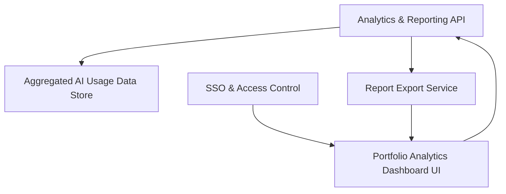

#### 1. High-Level Design
- Summary: Deliver a cloud-based portfolio analytics dashboard that consolidates AI usage and spend data, with real-time visualizations, benchmarking, drill-down analytics, configurable thresholds, customizable widgets, and exportable reports for stakeholders.
- Component Flow:

- Integration Points:
  - Secure data integrations with AWS, Azure, and GCP AI services via provider APIs (via ingestion layer).
  - Existing SSO provider for user authentication.
  - External/benchmark data sources for industry averages where applicable.
- Key Assumptions:
  - Industry benchmark datasets are periodically ingested into the same or a sidecar data store and exposed via the analytics API.
  - Exported PDF/Excel reports use standard enterprise document storage and distribution channels already in place.
- NFR Highlights: Dashboard load ≤3 seconds for 95% of interactions (up to 50 portfolio companies), support for up to 200 portfolio companies and 1,000 concurrent users, data ≤24 hours old, 99.5% uptime with automated failover and daily backups, WCAG 2.1 AA accessibility, TLS 1.2+ and AES-256 for data in transit/at rest.

#### 2. Validation Report
- Requirements Coverage: The design covers consolidated portfolio dashboard capabilities, real-time views, data freshness indicators, benchmarking, drill-down analytics, configurable thresholds, widget customization, report exports, and aligns with the epic’s performance, scalability, security, and accessibility constraints.
