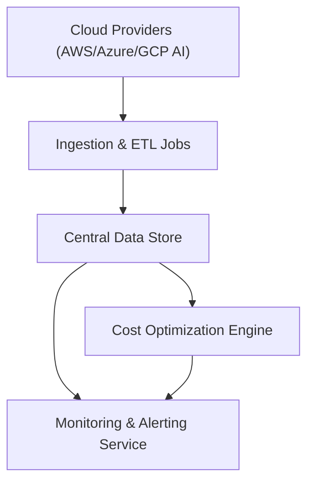

#### 1. High-Level Design
- Summary: Build secure, automated integrations and ingestion pipelines from AWS, Azure, GCP AI services into a central data platform, including freshness monitoring, threshold-based alerting, and an intelligence layer for cost optimization recommendations and scenario simulations.
- Component Flow:

- Integration Points:
  - Secure API-based integrations with AWS AI services, Azure AI services, and GCP AI services.
  - Internal monitoring tools for API health and data freshness checks.
  - Future integrations with niche/emerging AI platforms (phased).
- Key Assumptions:
  - Portfolio companies will configure and maintain necessary credentials/API access for their cloud environments.
  - Alert delivery channels (e.g., email, messaging tools) are already available and can be reused by the alerting service.
- NFR Highlights: Data must be ≤24 hours old under normal operations, budget breach alerts within 5 minutes of sync, TLS 1.2+ and AES-256 for data in transit/at rest, scale to data from ~200 portfolio companies, 99.5% uptime with automated failover and daily backups.

#### 2. Validation Report
- Requirements Coverage: The design covers secure multi-cloud integrations, periodic ingestion and aggregation, freshness monitoring, threshold-based alerting, and a recommendation/simulation layer aligned with the epic’s scope and specified non-functional requirements.
