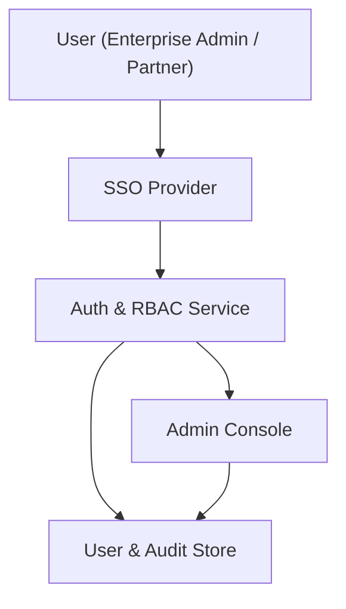

#### 1. High-Level Design
- Summary: Implement secure, role-based access control and administrative security capabilities for the AI Portfolio Management Dashboard, including SSO-based authentication, role/persona mappings, audit logging, and admin workflows for user and access lifecycle.
- Component Flow:

- Integration Points:
  - Existing SSO provider for user authentication.
  - Internal or third-party logging/monitoring infrastructure for audit logs and security alerts.
  - Infrastructure security services (KMS / certificate management) for encryption key and certificate handling.
- Key Assumptions:
  - Role definitions and persona-to-role mappings are provided and maintained by Enterprise Admins or a central security function.
  - Audit logs are retained and queryable for a period that meets the organization’s default security/compliance policy.
- NFR Highlights: Encryption in transit and at rest (TLS 1.2+, AES-256), mandatory RBAC and audit logging, support for ~1,000 concurrent users, 99.5% availability, SSO integration without noticeable login latency, WCAG 2.1 AA compliance for admin/security interfaces.

#### 2. Validation Report
- Requirements Coverage: The design addresses secure SSO-based authentication, RBAC enforcement, audit logging, admin workflows for user and access management, encryption and availability requirements, and persona-specific access needs as described in the epic.
