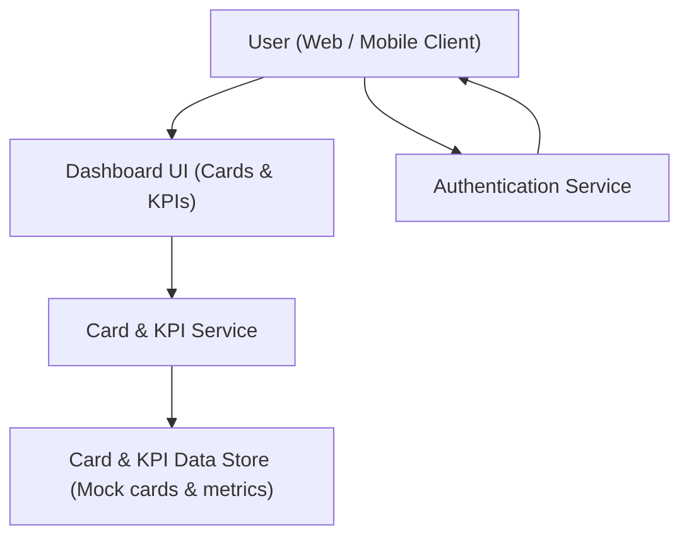

#### 1. High-Level Design
- Summary: Build a unified, responsive dashboard aggregating multiple credit cards, displaying per-card and aggregate KPIs (monthly spend, limits, available credit, outstanding amounts) with warnings to help users monitor overall credit usage.

- Component Flow:

- Integration Points:
  - Mock data generation for cards and KPIs
  - Selected frontend framework (e.g., React/Angular) for responsive dashboard layouts
  - Authentication service restricting access to authenticated users

- Key Assumptions:
  - Aggregate KPIs are computed on the fly from mock card data at dashboard load time.
  - Responsive behavior is implemented via standard layout mechanisms (e.g., CSS grid/flex) within the chosen frontend framework.

- NFR Highlights:
  - Dashboard must load within 2 seconds for up to 10 cards and 1,000 transactions, support 100,000 users, ensure encryption and authenticated access, comply with WCAG 2.1 AA, and deliver 99.5% uptime with clear error handling and fallbacks.

#### 2. Validation Report
- Requirements Coverage: The design supports consolidated card listing, per-card and aggregate KPIs, outstanding balance views, responsive layouts across devices, warnings for outstanding balance vs available credit, error handling for card data loading, and the documented performance, security, accessibility, and availability constraints.
