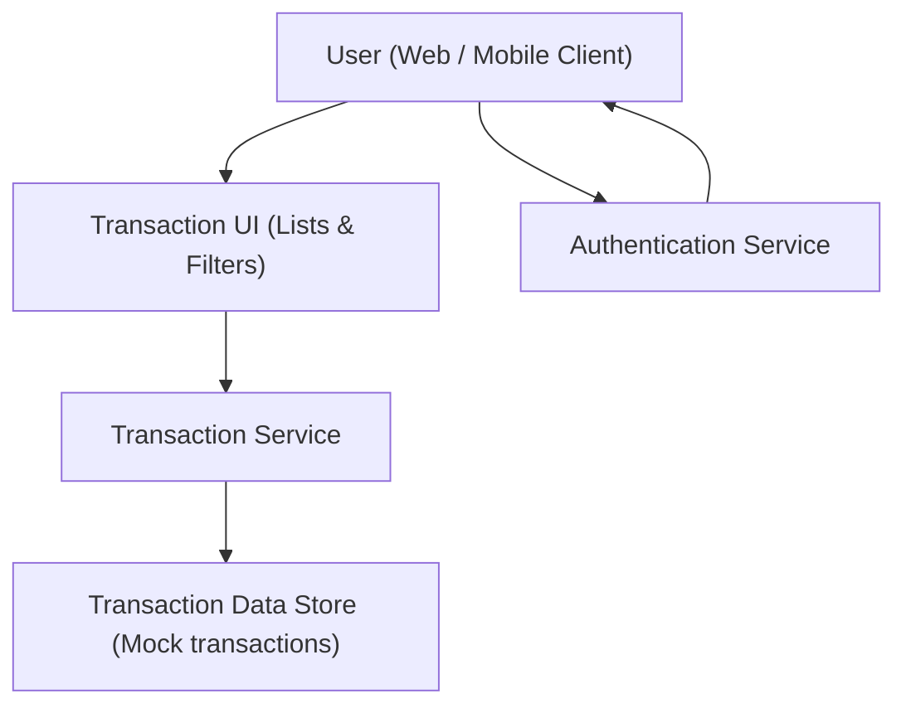

#### 1. High-Level Design
- Summary: Enable users to view detailed per-card transactions and apply filters (by category and date range), with robust loading, pagination, and export capabilities to inspect individual spending and audit transaction history.

- Component Flow:

- Integration Points:
  - Mock transaction data generation with realistic structures
  - Frontend framework components for tables, filtering, and pagination
  - Authentication service to ensure only authorized users view transaction data
  - Export capability to CSV/PDF when available

- Key Assumptions:
  - Filtering and pagination are applied server-side (or service-layer) to handle large datasets efficiently.
  - Exports reuse the same filtered transaction dataset currently displayed in the UI.

- NFR Highlights:
  - Dashboard and transaction views must load within 2 seconds for up to 10 cards and 1,000 transactions, support 100,000 users, enforce encryption and authenticated access, comply with WCAG 2.1 AA, and achieve 99.5% uptime with ≤1% failed loads and clear feedback.

#### 2. Validation Report
- Requirements Coverage: The design addresses per-card transaction lists, card selection, category/date filters, accurate filtered updates, pagination/efficient loading, export support, clear error messaging, and the stated performance, security, accessibility, and reliability requirements.

---

