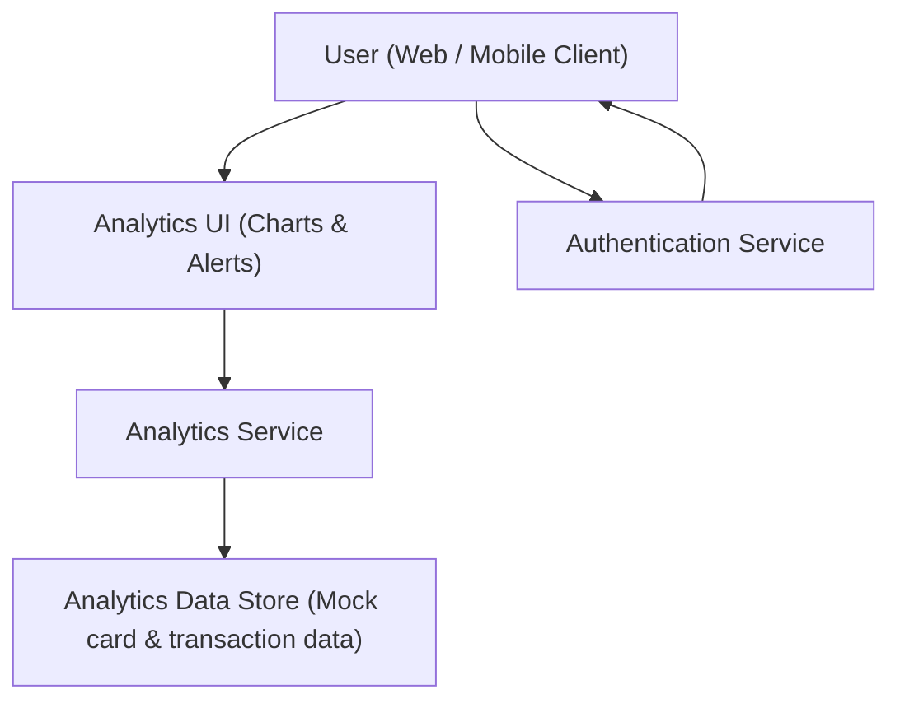

#### 1. High-Level Design
- Summary: Provide interactive spend analytics and configurable alerts so users can understand spending patterns, compare across categories and cards, export insights, and receive warnings when spending or credit utilization exceeds thresholds.

- Component Flow:

- Integration Points:
  - Mock analytical datasets derived from card and transaction mock data
  - Frontend visualization libraries for charts and interactive analytics
  - Authentication service for controlling access to analytics and alerts
  - Export utilities/libraries for CSV and PDF generation

- Key Assumptions:
  - Analytics data is refreshed periodically from mock data sources (e.g., batch load) rather than real-time.
  - Exports (CSV/PDF) are generated synchronously on request and downloaded via the UI.

- NFR Highlights:
  - Must load analytics views within 2 seconds for up to 10 cards and 1,000 transactions, scale to 100,000 users, ensure encryption in transit/at rest, comply with WCAG 2.1 AA, and meet 99.5% uptime with clear failure messaging.

#### 2. Validation Report
- Requirements Coverage: The design covers category-wise, monthly, and card-wise spend visualizations; miscellaneous category handling; exports; configurable alerts and warnings; multi-device support; and integrates mock data, auth, charts library, and export utilities in line with the epic’s stated scope and NFRs.

---

