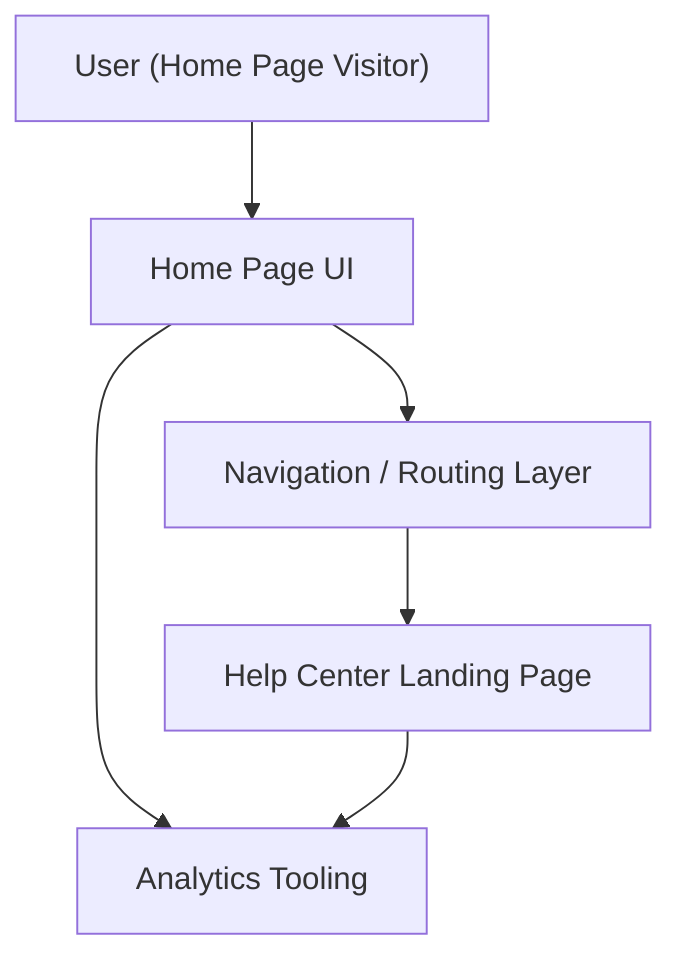

#### 1. High-Level Design
- Summary: Implement a prominent Help Center entry point on the Home Page (navigation or dedicated section) that routes users to the Help Center landing page with minimal impact on existing layout, behavior, and performance, while meeting accessibility and uptime requirements.
- Component Flow:

- Integration Points:
  - Existing website infrastructure and CMS for Home Page rendering and navigation.
  - Branding/design system for visual alignment of the entry point.
  - Analytics tooling to track Help Center entry usage and behavior.
  - Regression testing framework for verifying no Home Page regressions.
- Key Assumptions:
  - Entry point is configured using existing navigation components without requiring CMS schema changes.
  - Analytics events for entry clicks reuse existing site-wide tracking patterns.
- NFR Highlights: Must open Help Center landing page within 2–4 seconds, maintain 99.9% uptime, meet WCAG 2.1 AA, avoid degrading Home Page performance or causing layout shifts/regressions.

#### 2. Validation Report
- Requirements Coverage: The design addresses a prominent, accessible entry point in navigation or a dedicated section, seamless routing to the Help Center landing page, non-disruptive integration with current Home Page layout and performance, branding alignment, responsive behavior, accessibility requirements, and monitoring via analytics, in line with the epic’s stated scope and NFRs.

---
