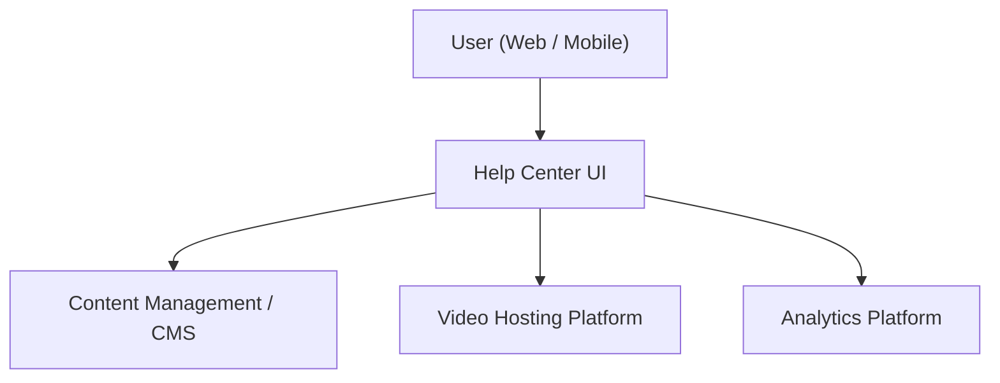

#### 1. High-Level Design
- Summary: Deliver a dedicated Help Center landing page with categorized, searchable content (articles, FAQs, videos, downloads) and analytics, providing a responsive, branded, and accessible self-service hub for onboarding and troubleshooting.
- Component Flow:

- Integration Points:
  - Existing website and CMS as the content source and rendering layer.
  - Video hosting platform for embedded tutorials.
  - Analytics platform for tracking usage and self-service metrics.
  - Editorial workflows for content creation and maintenance.
  - Survey/feedback mechanisms for article feedback and satisfaction scores (when enabled).
- Key Assumptions:
  - Search and filtering leverage existing CMS or search infrastructure with minimal custom backend changes.
  - Downloads (PDFs and guides) are served via existing file delivery/CDN infrastructure.
- NFR Highlights: Must load main Help Center in 2–4 seconds, support 100000 concurrent users, ensure secure HTTPS delivery, meet WCAG 2.1 AA, maintain 99.9% uptime, and scale search/content delivery for target traffic.

#### 2. Validation Report
- Requirements Coverage: The design supports a dedicated landing page, categorized content, in-page articles and FAQs, embedded videos, downloadable materials, search and filtering, responsive behavior, error handling for unavailable resources, branding and accessibility standards, analytics tracking, and article feedback, aligned with the epic’s NFRs.

---
