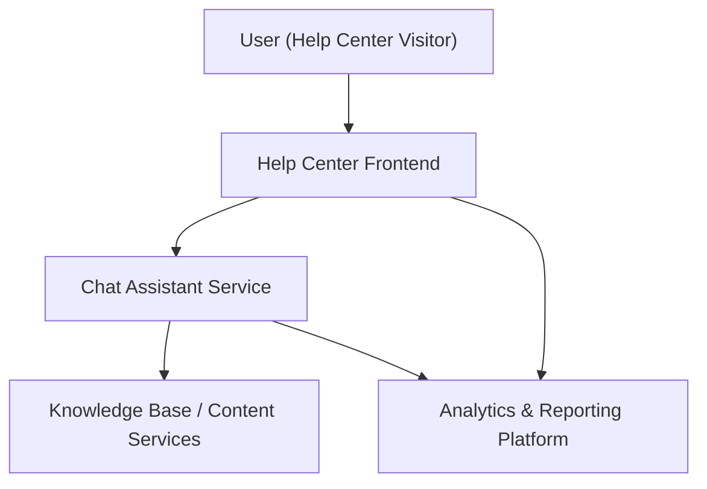

#### 1. High-Level Design
- Summary: Implement an interactive chat assistant within the Help Center landing page, with automated responses, content suggestions, and behavioral analytics to monitor self-service usage, identify common issues, and improve help content while meeting security, scalability, and accessibility requirements.
- Component Flow:

- Integration Points:
  - Help Center frontend for embedding the chat widget and UI.
  - Chat assistant technology/provider platform.
  - Knowledge base, articles, videos, and downloadable content services that chat links resolve to.
  - Analytics and event tracking platform for capturing interactions and KPIs.
  - Security/compliance processes for data handling and storage.
- Key Assumptions:
  - Chat and analytics events use a standard JSON-based event schema aligned with existing analytics tooling.
  - Analytics are captured asynchronously to avoid blocking Help Center or chat rendering.
- NFR Highlights: Must support 100000 concurrent users and 10000 simultaneous chat sessions, open chat window within 2–4 seconds, run securely over HTTPS, meet WCAG 2.1 AA, maintain 99.9% uptime, and avoid material page-load impact from analytics.

#### 2. Validation Report
- Requirements Coverage: The design covers embedding a chat assistant on the Help Center landing page, automated responses and links to resources, interaction tracking across Help Center features, monitoring of issues via chat analytics, feedback and optional recommendations, and alignment with specified scalability, security, performance, and accessibility NFRs.

---
