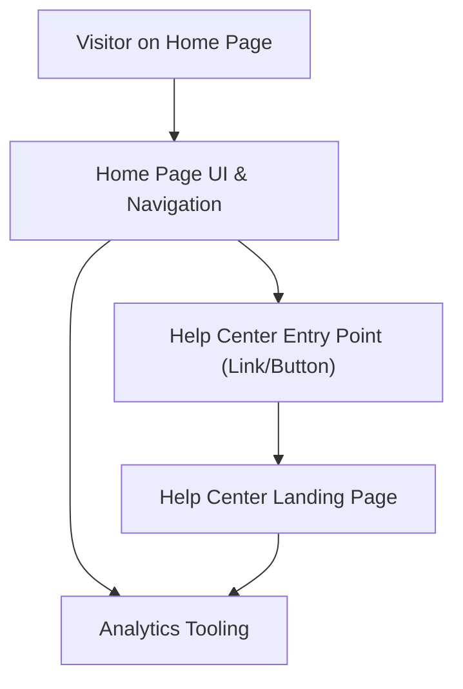

#### 1. High-Level Design
- Summary: Implement a prominent, accessible Help Center entry point on the Home Page (e.g., navigation item or section) that routes users into the dedicated Help Center, without disrupting existing Home Page behavior or performance.
- Component Flow:

- Integration Points:
  - Existing website infrastructure and CMS for routing from Home Page to Help Center.
  - Existing site navigation and layout framework.
  - Analytics tooling for tracking entry point usage and Help Center engagement.
  - Accessibility testing tools for WCAG compliance.
- Key Assumptions:
  - The Help Center landing URL is stable and can be configured as the target for the entry point without additional routing layers.
  - Existing navigation framework supports adding the entry point without structural refactoring of the Home Page.
- NFR Highlights: Help Center must open from Home Page within 2–4 seconds depending on network, support 100,000 concurrent users without degrading Home Page performance, run over HTTPS, meet WCAG 2.1 AA, and contribute to 99.9% uptime.

#### 2. Validation Report
- Requirements Coverage: The design introduces a visible, responsive Help Center entry point integrated with existing navigation, routes to the Help Center landing page, preserves current Home Page behavior, and aligns with specified accessibility, performance, and uptime requirements.

