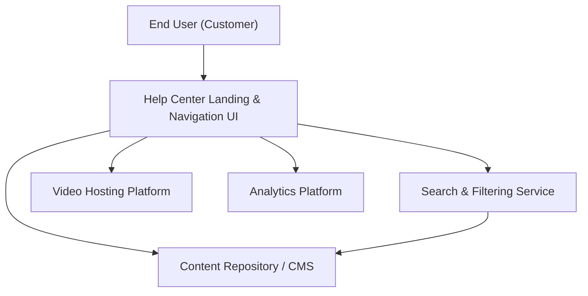

#### 1. High-Level Design
- Summary: Deliver a dedicated Help Center with a landing page, categorized content, articles, FAQs, videos, downloadable materials, and keyword search, all responsive and accessible, with basic analytics on content usage and user interactions.
- Component Flow:

- Integration Points:
  - Existing website infrastructure and CMS for hosting Help Center content.
  - Video hosting platform for embedded tutorials.
  - Analytics platform for tracking usage, search behavior, and content performance.
  - Design system for consistent styling and layout.
- Key Assumptions:
  - The existing CMS already exposes APIs or templates adequate for category-based listing, article rendering, and search indexing.
  - Search will leverage either the existing site search engine or a standard search service configured with Help Center content indices.
- NFR Highlights: Page and content load within 2–4 seconds depending on network, video starts within 3 seconds, HTTPS for downloads, supports 100,000 concurrent users, WCAG 2.1 AA, and 99.9% uptime.

#### 2. Validation Report
- Requirements Coverage: The design covers a dedicated Help Center landing experience, categorized content, multi-format resources (articles, FAQs, videos, downloads), keyword search and filtering, responsive UI, accessibility, and analytics, in line with the epic’s scope and NFRs.

