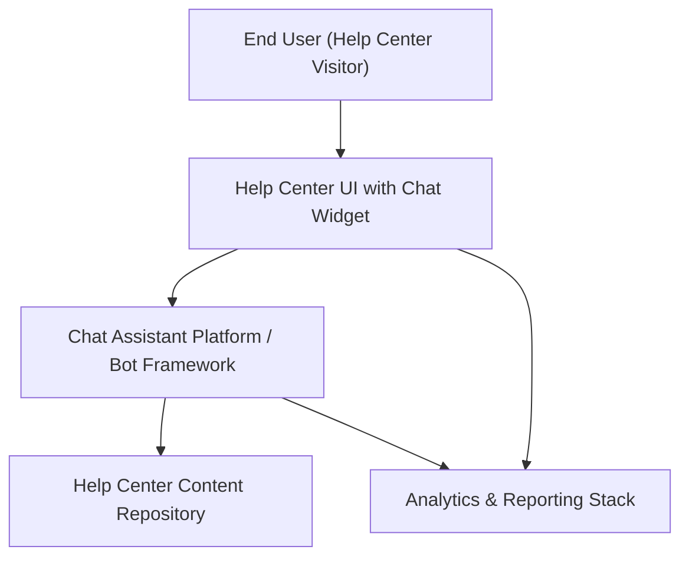

#### 1. High-Level Design
- Summary: Implement an integrated, automated chat assistant within the Help Center that provides real-time, secure, and accessible support with links to relevant content, while capturing analytics and behavioral insights on user interactions and self-service patterns.
- Component Flow:

- Integration Points:
  - Chat assistant technology platform / bot framework.
  - Existing website infrastructure embedding the chat in the Help Center.
  - Help Center content repository for articles and materials.
  - Analytics tooling for chat interactions and Help Center usage.
- Key Assumptions:
  - Chat assistant exposes a standard web SDK/API suitable for embedding into the existing Help Center UI.
  - Analytics events (chat interactions, journeys) are sent via existing site analytics mechanisms with agreed event taxonomy.
- NFR Highlights: Chat must open within 2 seconds, support up to 10,000 simultaneous chat sessions and 100,000 concurrent users overall, run over HTTPS, meet WCAG 2.1 AA, and deliver 99.9% uptime.

#### 2. Validation Report
- Requirements Coverage: The proposed design supports an embedded chat assistant in the Help Center, integrates with content and analytics, addresses responsiveness, security, accessibility, and scalability, and aligns with the described scope and dependencies.

