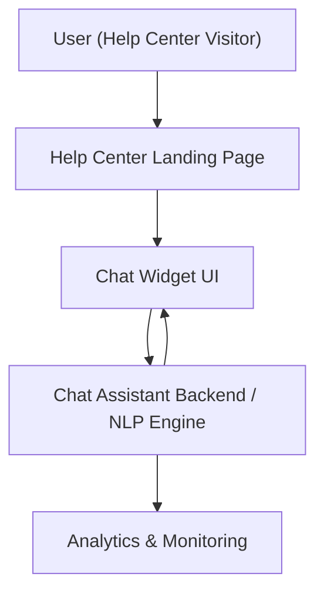
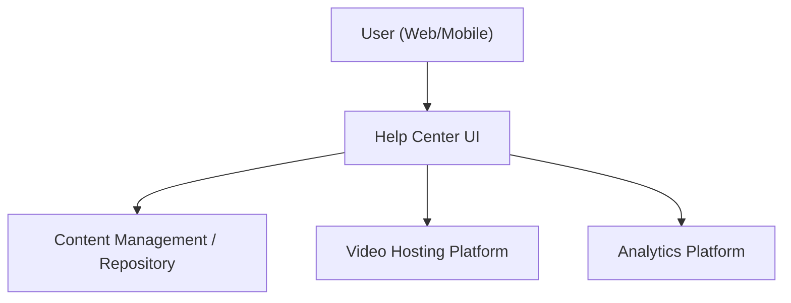
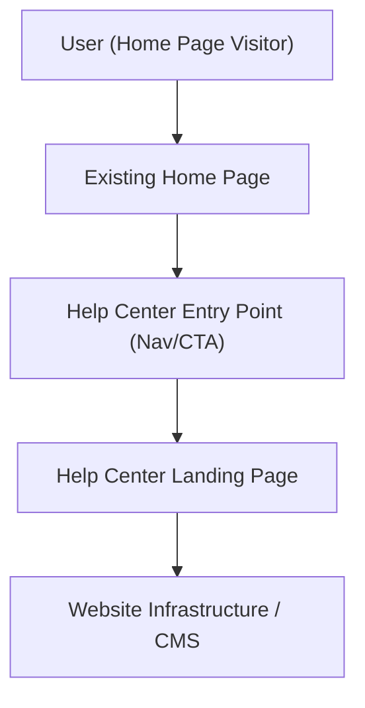

#### 1. High-Level Design
- Summary: Implement an interactive chat assistant embedded in the Help Center landing page to provide automated, real-time user support, surface relevant help content, and capture analytics on chat usage and issues, while meeting strict security, privacy, performance, and accessibility constraints.
- Component Flow:

- Integration Points:
  - Help Center landing page and existing website infrastructure for embedding the chat widget.
  - Chat assistant technology platform (hosted or SaaS) providing NLP and response orchestration.
  - Analytics tools capturing chat usage, performance metrics, and content gaps.
  - Editorial/support team workflows to update and maintain the assistant’s knowledge base.
- Key Assumptions:
  - Chat assistant platform exposes a secure web widget and REST/HTTPS APIs for integration with the Help Center.
  - Analytics events for chat interactions are sent to the existing analytics platform used by the Help Center.
- NFR Highlights: Must support up to 10,000 simultaneous sessions, be served over HTTPS, open the chat window within 2 seconds, achieve 99.9% availability, and comply with WCAG 2.1 AA accessibility and privacy constraints.

#### 2. Validation Report
- Requirements Coverage: The proposed design embeds a chat widget in the Help Center landing page, routes user queries to the chat assistant backend, returns automated answers and links to help content, and sends interaction data to analytics. It aligns with the scope (self-service chat, links to articles, monitoring and analytics), respects the security and accessibility NFRs, and supports high concurrency, thereby covering the epic’s stated requirements at a high level.

---

### Epic: QE-5669 - KGPH-Help Center Content Experience and Search

#### 1. High-Level Design
- Summary: Provide a rich Help Center content experience that organizes categorized articles, FAQs, videos, and downloadable documents, with robust search, filtering, personalization, feedback, and analytics, ensuring fast, accessible, and responsive content delivery across devices.
- Component Flow:

- Integration Points:
  - Existing website infrastructure and CMS hosting help articles, FAQs, PDFs, and other documents.
  - Video hosting platform for embedded tutorials.
  - Analytics tooling for tracking page views, search queries, downloads, and user feedback.
  - Editorial team workflows for content creation, updates, categorization, and recommendations.
- Key Assumptions:
  - Search is implemented over the existing CMS/content index using a search service integrated with the Help Center UI.
  - Personalization and recommendations leverage existing analytics or recommendation capabilities rather than introducing a new standalone engine.
- NFR Highlights: Content pages must load within 2 seconds (videos within 3 seconds), support up to 100,000 concurrent users, serve downloads over HTTPS, meet WCAG 2.1 AA accessibility, and maintain 99.9% uptime with robust error handling.

#### 2. Validation Report
- Requirements Coverage: The design supports categorized content presentation, multi-format content (articles, FAQs, videos, downloads), keyword search, filtering, feedback, bookmarking, and analytics tracking. It integrates with existing CMS and video platforms, routes usage data to analytics, and adheres to the performance, scalability, security, and accessibility NFRs, thereby covering the epic’s stated scope and user value at a high level.

---

### Epic: QE-5668 - KGPH-Help Center Entry Point and Home Page Integration

#### 1. High-Level Design
- Summary: Introduce a prominent Help Center entry point on the Home Page that routes users to a dedicated Help Center landing page, ensuring seamless integration with existing navigation, branding, performance, and accessibility standards without disrupting current Home Page functionality.
- Component Flow:

- Integration Points:
  - Existing Home Page navigation or sections where the Help Center entry point will be placed.
  - Routing and URL configuration to direct traffic from the Home Page to the Help Center landing page.
  - Existing CMS and page templates for both the Home Page and Help Center.
  - Branding/design system assets to ensure visual and UX alignment.
- Key Assumptions:
  - The Help Center landing page is deployed within the same domain and infrastructure as the Home Page, allowing reuse of navigation and branding components.
  - Feature flags or configuration are used to safely roll out the new entry point without impacting existing Home Page behavior.
- NFR Highlights: Help Center landing page must load within 2 seconds (4 seconds on mobile networks), support up to 100,000 concurrent users, be served over HTTPS, comply with WCAG 2.1 AA, and not degrade existing Home Page performance or layout stability while maintaining 99.9% uptime.

#### 2. Validation Report
- Requirements Coverage: The design introduces a clear entry point on the Home Page, routes users to a dedicated Help Center landing page, reuses existing CMS and design system for visual alignment, and enforces performance, accessibility, and stability constraints. It respects the stated scope and out-of-scope boundaries and fulfills the epic’s goal of improving Help Center discoverability and seamless integration with the Home Page.