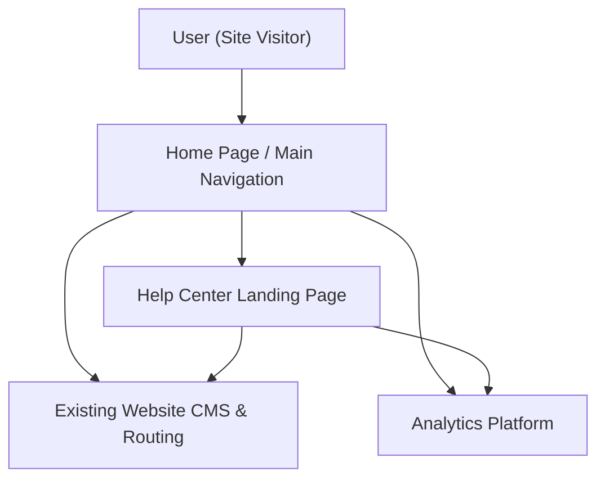

#### 1. High-Level Design
- Summary: Provide a clearly visible Help Center entry point from the Home Page and seamless navigation to a dedicated Help Center landing page, ensuring discoverable, accessible self-service support without disrupting existing Home Page functionality.

- Component Flow:

- Integration Points:
  - Existing website navigation framework (e.g., header nav, footer links, or dedicated Help Center section).
  - Existing CMS and routing infrastructure for serving the Help Center landing page and its categorized content.
  - Analytics tooling to track entry point usage (clicks, navigation paths, drop-offs).

- Key Assumptions:
  - The Help Center landing page is hosted within the same web domain and routing framework as the Home Page, reusing existing theming and layout components.
  - Analytics tags for entry point clicks and Help Center navigation are implemented using the current enterprise analytics/tag management solution.

- NFR Highlights:
  - Landing page load within 2 seconds (broadband) and 4 seconds (mobile); WCAG 2.1 AA compliant navigation; 99.9% uptime; support for up to 100,000 concurrent users without navigation degradation; all navigation over HTTPS.

#### 2. Validation Report
- Requirements Coverage: The design fulfills the epic scope: a prominent Help Center entry point in main navigation or Home Page section, navigation to a dedicated Help Center landing page, preservation of existing Home Page behavior, display of categorized help content on the landing page, branding alignment, accessibility-compliant navigation and layout, responsive behavior across devices, and meaningful error handling for unavailable landing page content. NFRs for performance, accessibility, scale, HTTPS, and uptime are incorporated into the architecture and routing/analytics approach.

